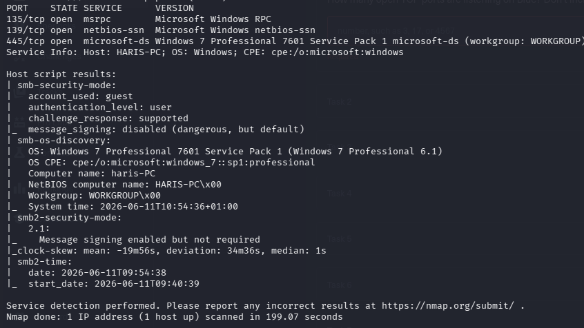
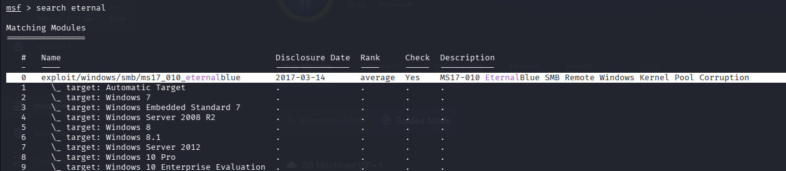
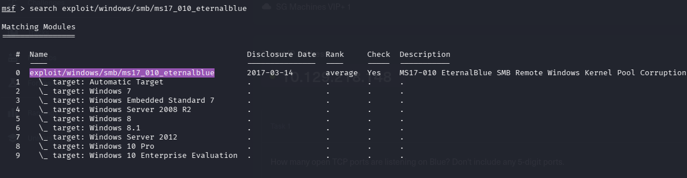
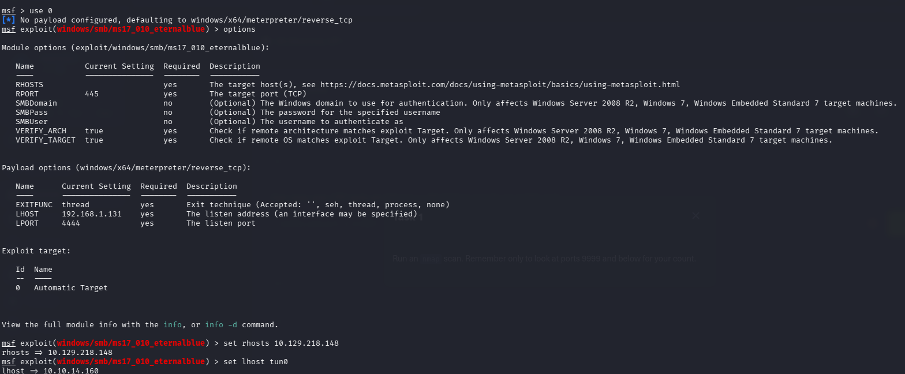
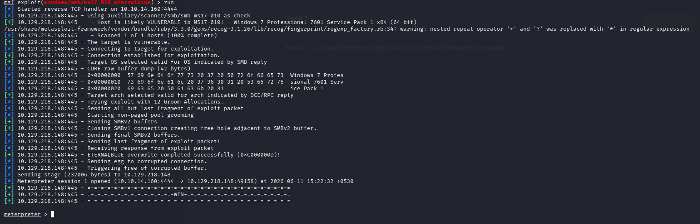
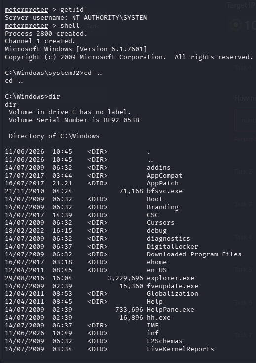
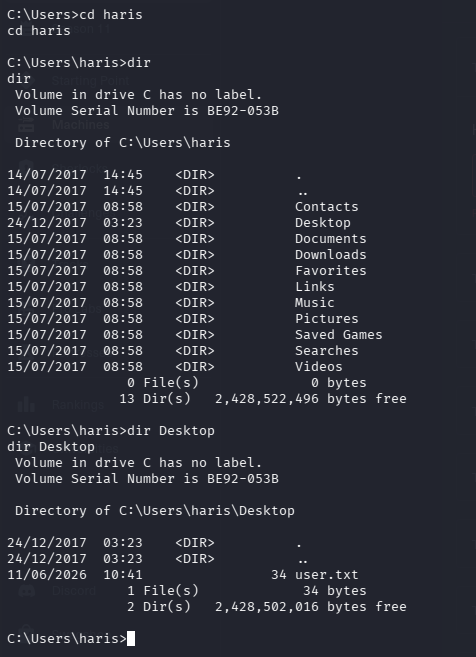
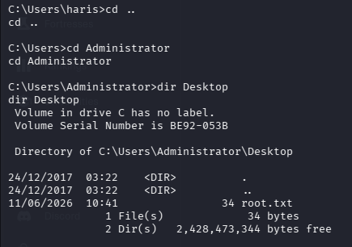

# Hack The Box — Blue

> **Platform:** Hack The Box  
> **Machine:** Blue  
> **Difficulty:** Easy  
> **Operating System:** Windows  
> **Assessment Type:** Black-Box  
> **Objective:** Obtain user and SYSTEM access by identifying and exploiting exposed network services.

---

# Overview

Blue is a classic Windows machine that focuses on one of the most well-known vulnerabilities in Microsoft's history: **MS17-010 (EternalBlue)**. While the vulnerability itself is widely documented, the machine highlights the importance of accurate service enumeration and vulnerability validation before attempting exploitation.

The objective of this assessment was to enumerate the exposed services, identify vulnerable software, obtain an initial foothold, and verify complete system compromise.

Rather than relying solely on automated tools, each step of the assessment follows the same methodology used during a real penetration test: gather information, validate findings, choose the most appropriate attack path, and document the reasoning behind every decision.

---

# Attack Path

```
Reconnaissance
      │
      ▼
Service Enumeration
      │
      ▼
Identify SMB Service
      │
      ▼
Validate MS17-010 Exposure
      │
      ▼
Select EternalBlue Exploit
      │
      ▼
Remote Code Execution
      │
      ▼
Meterpreter Session
      │
      ▼
User Enumeration
      │
      ▼
SYSTEM Access
```

---

# Initial Reconnaissance

As with any engagement, the first step was to identify the services exposed by the target.

I performed a standard Nmap scan using default scripts and service version detection.

```bash
nmap -sC -sV -oN nmap_scan 10.129.218.148
```

### Scan Result

> 📷 **Screenshot**



The scan identified several Windows services.

| Port | Service | Version |
|-------|----------|----------|
|135|MSRPC|Microsoft Windows RPC|
|139|NetBIOS|Microsoft Windows NetBIOS|
|445|SMB|Windows 7 Professional SP1|

The SMB service immediately became the primary focus of the assessment.

Nmap also identified the operating system as **Windows 7 Professional Service Pack 1**, a version historically associated with the **MS17-010 (EternalBlue)** vulnerability.

Another interesting observation was that SMB message signing was **enabled but not required**, indicating a legacy SMB configuration commonly seen on vulnerable Windows systems.

---

# Attack Surface Analysis

With the operating system identified, the next objective was to determine whether the exposed SMB service was susceptible to publicly known remote code execution vulnerabilities.

Among Windows SMB vulnerabilities, **MS17-010 (EternalBlue)** is one of the most critical due to its ability to achieve unauthenticated remote code execution over TCP port 445.

Because both the operating system version and exposed SMB service matched known vulnerable targets, I decided to investigate whether Metasploit included a suitable exploit module.

---

# Searching for an Exploit

Using Metasploit's search functionality, I looked for available EternalBlue modules.

```text
search eternal
```

> 📷 **Screenshot**



The framework returned the **MS17-010 EternalBlue SMB Remote Windows Kernel Pool Corruption** exploit module.

To verify the exact module path before loading it, I searched again using the complete module name.

```text
search exploit/windows/smb/ms17_010_eternalblue
```

> 📷 **Screenshot**



After confirming the correct module, I loaded it for further configuration.

---

# Configuring the Exploit

Before launching the exploit, I reviewed the required options to ensure the module was correctly configured.

```text
options
```

> 📷 **Screenshot**



The following parameters were configured:

- **RHOSTS** – Target IP Address
- **LHOST** – VPN Interface (tun0)
- **LPORT** – Reverse TCP Listener

Once the configuration was complete, the module was ready for execution.

---

# Initial Access

With the exploit configured, I executed the module.

```text
run
```

> 📷 **Screenshot**



Before attempting exploitation, Metasploit automatically performed a vulnerability check.

The check confirmed that the target was running **Windows 7 Professional Service Pack 1 (x64)** and was likely vulnerable to MS17-010.

After several stages of kernel memory manipulation and SMB packet grooming, the exploit completed successfully and established a Meterpreter session.

At this point, remote code execution had been achieved.

---

# Verifying Privileges

Since EternalBlue targets the Windows kernel, successful exploitation generally results in execution with **NT AUTHORITY\SYSTEM** privileges.

To verify this, I checked the current security context.

```text
getuid
```

The session confirmed:

```
NT AUTHORITY\SYSTEM
```

> 📷 **Screenshot**



With SYSTEM-level privileges already obtained, no additional privilege escalation techniques were required.

---

# User Enumeration

With unrestricted access to the system, I began exploring the filesystem.

The user profile directories were located under:

```cmd
C:\Users
```

Navigating to the `haris` user's Desktop revealed the user flag.

```cmd
cd C:\Users\haris\Desktop

dir
```

> 📷 **Screenshot**



Reading the contents of `user.txt` confirmed successful user-level compromise.

---

# SYSTEM Access

Because the exploit executed directly in kernel space, SYSTEM privileges were already available.

I navigated to the Administrator profile to verify complete compromise.

```cmd
cd C:\Users\Administrator\Desktop

dir
```

> 📷 **Screenshot**



The Administrator Desktop contained the `root.txt` flag.

Successfully accessing this file confirmed complete control over the target system.

---

# Findings

| Finding | Severity |
|----------|----------|
|MS17-010 (EternalBlue) Remote Code Execution|Critical|
|Outdated Windows 7 Professional SP1 Installation|Critical|
|SMB Service Exposed to the Network|High|

---

# Lessons Learned

Blue demonstrates how dangerous legacy Windows systems become when critical security patches are not applied.

Several practical lessons stand out from this assessment:

- Accurate operating system detection significantly narrows the attack surface.
- SMB should always receive special attention during Windows assessments due to its long history of critical vulnerabilities.
- Public exploit frameworks such as Metasploit are valuable tools, but understanding the vulnerability being exploited is equally important.
- Modern environments are generally protected against EternalBlue through security updates, making patch management one of the most effective defensive measures.
- Successful exploitation does not eliminate the need for verification. Confirming privileges, validating access, and documenting the compromise remain essential parts of any assessment.

---

# Tools Used

- Nmap
- Metasploit Framework
- Meterpreter
- Windows Command Prompt

---

# References

- Microsoft Security Bulletin MS17-010
- CVE-2017-0144
- EternalBlue
- Hack The Box — Blue

---

> **Disclaimer**
>
> This walkthrough documents an assessment performed exclusively within the authorized Hack The Box laboratory environment. It is intended for educational purposes and to demonstrate penetration testing methodology in a controlled setting.