# Hack The Box — Jerry

> **Platform:** Hack The Box  
> **Machine:** Jerry  
> **Difficulty:** Easy  
> **Operating System:** Windows  
> **Assessment Type:** Black-Box  
> **Objective:** Obtain administrative access by exploiting exposed Apache Tomcat Manager credentials and deploying a malicious WAR application.

---

# Overview

Jerry is an excellent introductory machine that demonstrates how exposed administrative interfaces can quickly lead to complete system compromise.

Unlike vulnerabilities that require exploiting memory corruption or chaining multiple weaknesses, this machine highlights a much more common real-world problem: **poor credential management**.

During the assessment, the exposed Apache Tomcat service was identified, the Tomcat Manager interface was accessed using valid credentials, a malicious Java web application was deployed, and a reverse shell was obtained with administrative privileges.

Although technically straightforward, the machine reinforces an important lesson:

> Weak authentication can be just as dangerous as software vulnerabilities.

---

# Attack Path

```
Reconnaissance
      │
      ▼
Service Enumeration
      │
      ▼
Apache Tomcat Discovery
      │
      ▼
Tomcat Manager Access
      │
      ▼
Malicious WAR Generation
      │
      ▼
WAR Deployment
      │
      ▼
Reverse Shell
      │
      ▼
SYSTEM Access
      │
      ▼
User & Root Flags
```

---

# Initial Reconnaissance

As with every assessment, the engagement began by identifying the services exposed by the target.

An Nmap scan was performed using default NSE scripts together with service version detection.

```bash
nmap -sC -sV -oN nmap_scan 10.129.136.9
```

## Scan Result

> 📷 **Screenshot**

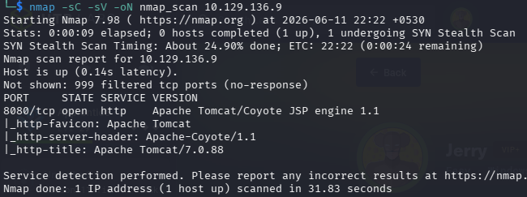

The scan revealed a single externally accessible service.

| Port | Service | Version |
|-------|----------|----------|
|8080|HTTP|Apache Tomcat 7.0.88|

Although only one service was exposed, it immediately became the primary attack surface.

Apache Tomcat frequently exposes administrative interfaces that, if improperly secured, can provide attackers with direct code execution.

---

# Web Enumeration

Browsing to the application revealed the default Apache Tomcat landing page.

> 📷 **Screenshot**

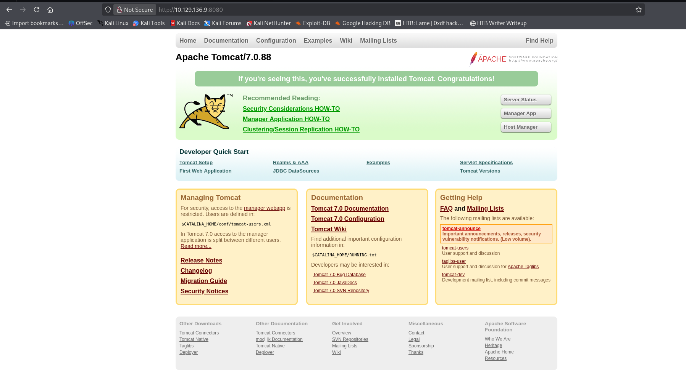

The page confirmed that the server was running **Apache Tomcat 7.0.88**.

While the default page itself exposed no sensitive functionality, it indicated that the Tomcat installation had not been customized.

One item immediately stood out.

The page contained links to the **Manager Application**, which is commonly used by administrators to deploy and manage web applications.

This became the next target for enumeration.

---

# Tomcat Manager

Navigating to the Tomcat Manager interface presented the administrative dashboard.

> 📷 **Screenshot**

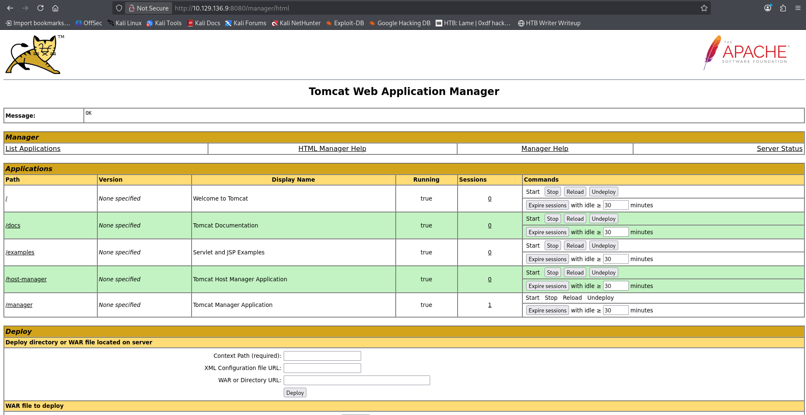

Access to the Manager interface had already been established using valid credentials.

This represented a significant security issue.

The Tomcat Manager allows authenticated administrators to:

- Deploy WAR applications
- Undeploy applications
- Start and stop web applications
- Execute arbitrary server-side Java code

With administrative access to this interface, remote code execution could be achieved without exploiting any software vulnerability.

---

# Initial Access Strategy

Instead of relying on Metasploit's automatic payload generation, I decided to manually create a JSP reverse shell and package it as a deployable WAR archive.

This approach provides greater visibility into the attack process and mirrors how malicious Java web applications are commonly deployed during penetration tests.

---

# Creating the Reverse Shell

Using **revshells.com**, I generated a Java Server Pages (JSP) reverse shell configured to connect back to my attacking machine.

> 📷 **Screenshot**

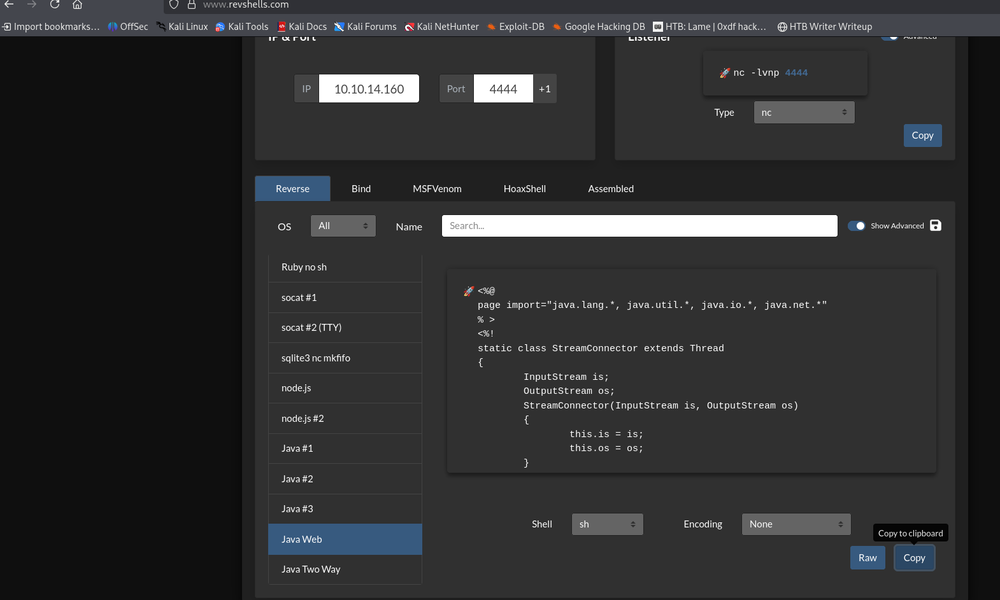

The generated payload was saved locally as:

```
revshell.jsp
```

Since Apache Tomcat deploys Java web applications packaged as WAR archives, the JSP payload needed to be bundled into a deployable application.

---

# Packaging the WAR

The JSP payload was archived into a standard Java Web Archive using the `jar` utility.

```bash
jar -cvf revshell.war revshell.jsp
```

> 📷 **Screenshot**

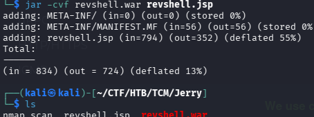

The archive was successfully created.

> 📷 **Screenshot**

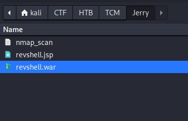

At this point, the payload was ready for deployment through the Tomcat Manager interface.

---

# Deploying the Payload

Using the **Deploy WAR file** functionality provided by the Tomcat Manager, the generated archive was uploaded to the server.

Once uploaded, Tomcat automatically unpacked and deployed the application.

> 📷 **Screenshot**

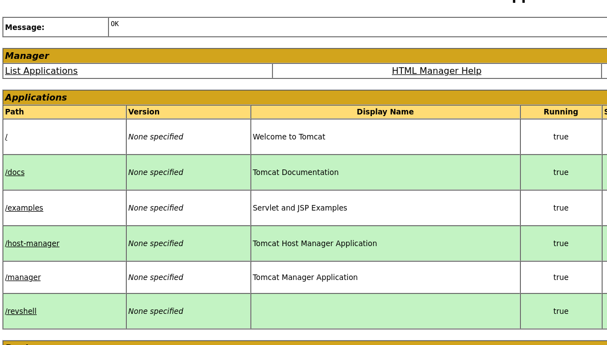

The deployment completed successfully, and a new application appeared in the Manager interface.

> 📷 **Screenshot**

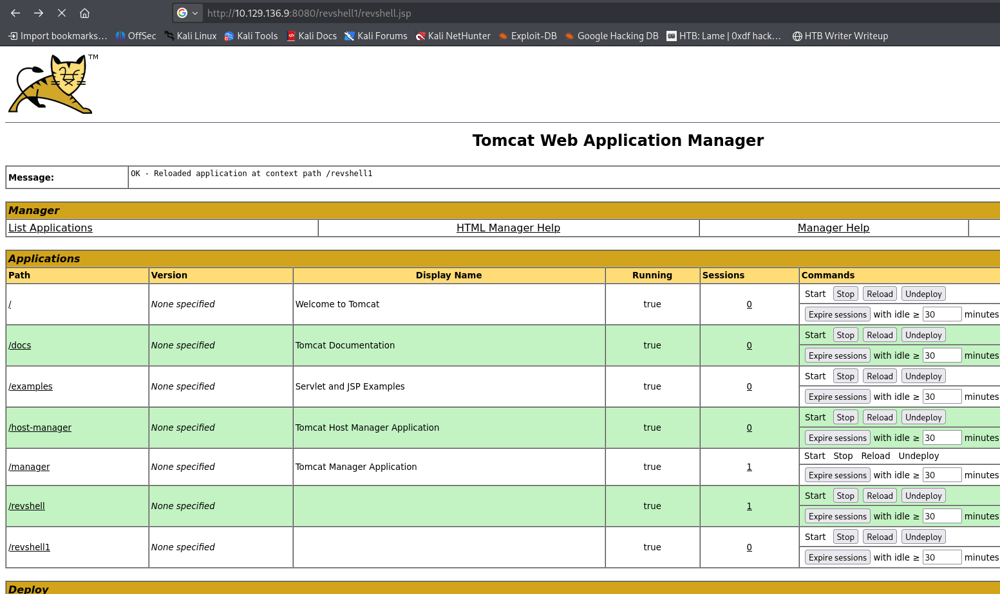

The presence of the deployed application confirmed that arbitrary code could now be executed on the server.

The final step was simply to trigger the JSP payload while listening for the incoming reverse shell.

---
# Triggering the Payload

Before executing the deployed application, a Netcat listener was started on the attacking machine to receive the incoming reverse connection.

```bash
nc -lvnp 4444
```

The deployed JSP payload was then accessed through the browser.

```
http://10.129.136.9:8080/revshell/revshell.jsp
```

Once the payload executed, the server initiated a reverse connection back to the listener.

> 📷 **Screenshot**

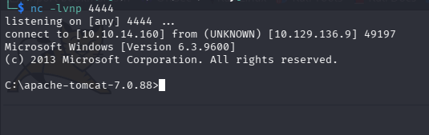

An interactive Windows command shell was successfully obtained.

---

# Meterpreter Access

To simplify post-exploitation, the deployment was also performed using Metasploit's Tomcat Manager upload module.

The module authenticated to the Tomcat Manager, uploaded a malicious WAR application, executed it, and established a Meterpreter session.

```text
exploit/multi/http/tomcat_mgr_upload
```

> 📷 **Screenshot**

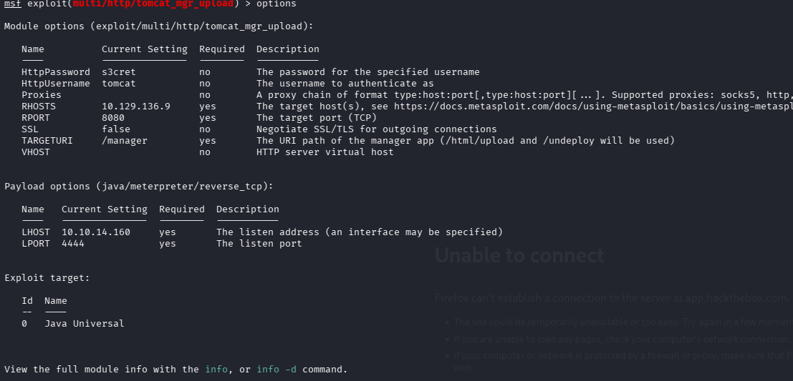

After execution, Meterpreter connected successfully.

> 📷 **Screenshot**

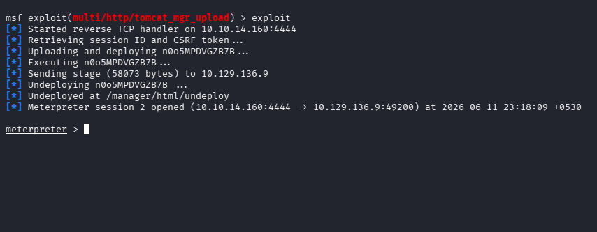

This provided a more feature-rich shell for post-exploitation activities.

---

# Privilege Verification

A shell was spawned from the Meterpreter session.

```text
meterpreter > shell
```

The current user context was verified.

```cmd
whoami
```

Output:

```text
nt authority\system
```

> 📷 **Screenshot**

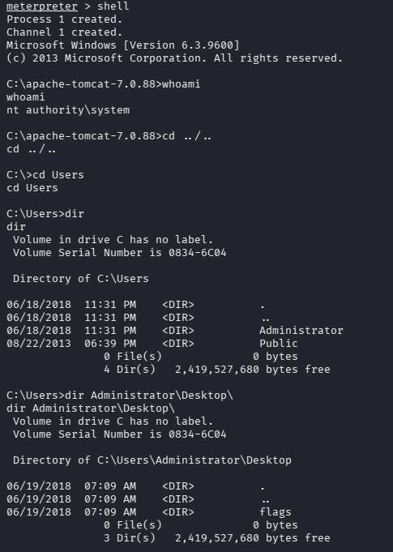

The reverse shell was already executing with **NT AUTHORITY\SYSTEM**, meaning no privilege escalation was required.

---

# User Enumeration

The local user directories were enumerated.

```cmd
cd C:\Users

dir
```

> 📷 **Screenshot**


The Administrator profile was identified as the primary target.

---

# Administrator Desktop

Navigating to the Administrator Desktop revealed a folder named **flags**.

```cmd
cd Administrator\Desktop
dir
```

> 📷 **Screenshot**


Unlike traditional Hack The Box machines, Jerry stores both flags inside this directory.

---

# Capturing the Flags

Inside the **flags** directory, both the user and root flags were available.

The objectives of the assessment were successfully completed.

---

# Findings

| Finding | Severity |
|----------|----------|
| Exposed Apache Tomcat Manager Interface | High |
| Administrative Credentials Allowed Manager Access | Critical |
| Arbitrary WAR Deployment | Critical |
| Remote Code Execution | Critical |
| SYSTEM Privilege Obtained | Critical |

---

# Attack Summary

```
Nmap Enumeration
        │
        ▼
Apache Tomcat 7.0.88
        │
        ▼
Tomcat Manager Interface
        │
        ▼
Valid Credentials
        │
        ▼
Generate JSP Reverse Shell
        │
        ▼
Package as WAR
        │
        ▼
Deploy via Manager
        │
        ▼
Execute JSP
        │
        ▼
Reverse Shell
        │
        ▼
NT AUTHORITY\SYSTEM
        │
        ▼
Capture User & Root Flags
```

---

# Skills Practiced

- Network Enumeration
- Service Fingerprinting
- Apache Tomcat Enumeration
- Web Application Administration Abuse
- Java WAR Payload Generation
- JSP Reverse Shell Deployment
- Reverse Shell Handling
- Meterpreter Usage
- Windows Post-Exploitation
- Windows File System Enumeration

---

# Tools Used

- Nmap
- Firefox
- Apache Tomcat Manager
- revshells.com
- Java (`jar`)
- Netcat
- Metasploit Framework
- Meterpreter

---

# Key Takeaways

- Administrative interfaces should never be exposed without strong authentication.
- Default or weak credentials remain one of the most common causes of compromise.
- WAR deployment provides legitimate remote code execution functionality when administrative access is obtained.
- Not every compromise requires exploiting a software vulnerability—misconfiguration and credential exposure can be equally severe.
- Always enumerate available management interfaces during web application assessments.

---

# References

- Apache Tomcat Documentation
- OWASP Web Security Testing Guide
- Metasploit Framework
- Hack The Box

---

# Disclaimer

This walkthrough is intended for educational purposes only. All testing was performed in an authorized Hack The Box laboratory environment.


