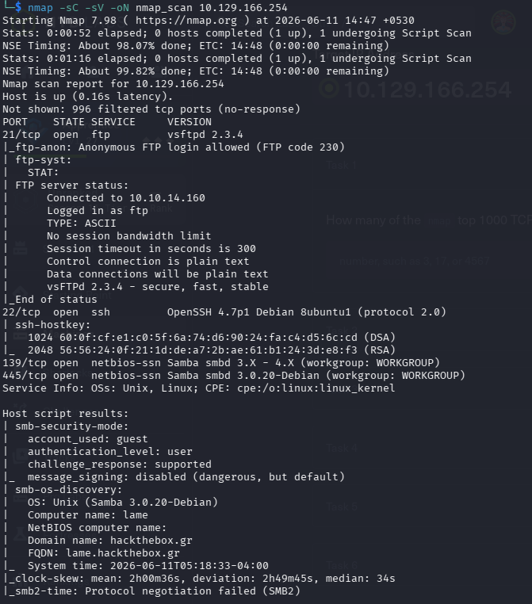

# HTB - Lame

Difficulty: Easy

Platform: Linux

Category:
- SMB
- FTP
- Remote Code Execution
- Privilege Escalation

---

## Assessment Overview

Target IP

10.10.10.3

Objective

Obtain user and root privileges while documenting the assessment process.

---

## Attack Chain

Recon
↓

Service Enumeration

↓

SMB Enumeration

↓

VsFTPd Backdoor Discovery

↓

Remote Code Execution

↓

Privilege Escalation

↓

Root Access

---

## Report

See:

HTB-Lame-VAPT-Report.pdf

or continue below.

...
## NMAP scan : 

