# Nibbles

> **Difficulty:** Easy  
> **Operating System:** Linux

---

# Overview

Nibbles is an easy Linux machine focused on web enumeration, CMS discovery, authenticated file upload abuse, and Linux privilege escalation. The machine revolves around identifying the Nibbleblog CMS, abusing an authenticated plugin upload vulnerability to gain remote code execution, and escalating privileges through an insecure sudo configuration.

---

# Enumeration

The initial step was to identify the exposed network services.

```bash
nmap -sC -sV -oN nmap_scan 10.129.166.240
```

The scan revealed only two open ports.

- **22/tcp** – OpenSSH 7.2p2
- **80/tcp** – Apache HTTP Server 2.4.18 (Ubuntu)

> 📷 **Screenshot**

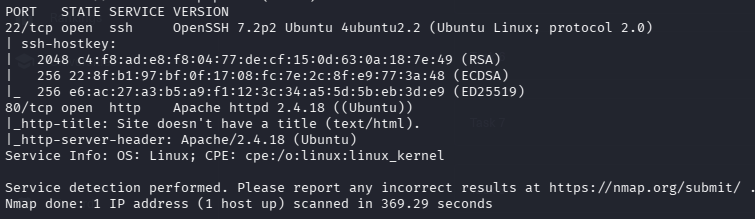

---

# Web Enumeration

Visiting the web server displayed a very minimal page.

```
http://10.129.166.240
```

The homepage contained only a **"Hello world!"** message, offering little useful information.

> 📷 **Screenshot**

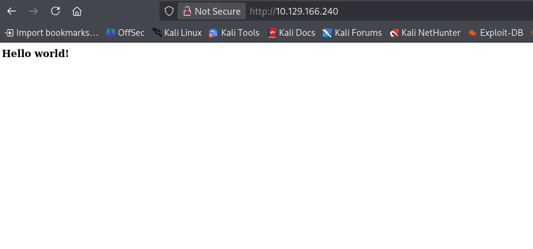

---

# Reviewing the Source Code

Inspecting the page source revealed an interesting HTML comment.

```html
<!-- /nibbleblog/ directory. Nothing interesting here! -->
```

Although the comment claimed there was nothing of interest, it disclosed the existence of a hidden directory.

> 📷 **Screenshot**

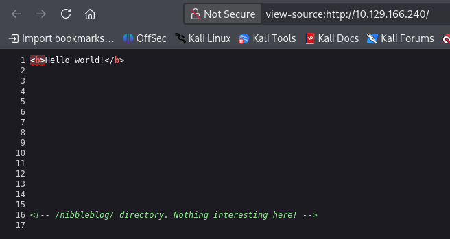

---

# Nibbleblog Enumeration

Browsing to the discovered directory exposed the Nibbleblog CMS.

```
http://10.129.166.240/nibbleblog/
```

The application identified itself as **Nibbleblog**, providing a valuable fingerprint for vulnerability research.

> 📷 **Screenshot**

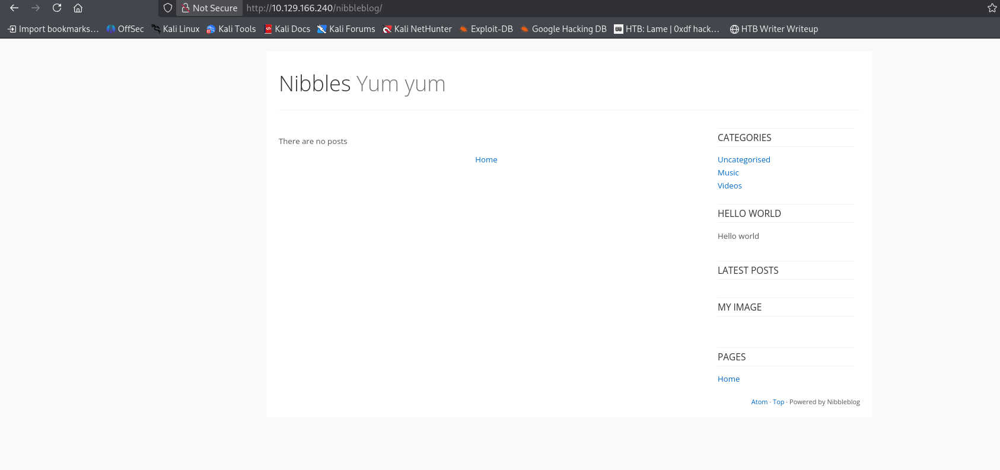

---

# Searching for Public Exploits

A quick Searchsploit search revealed publicly available exploits for the detected CMS.

```bash
searchsploit nibbleblog
```

Relevant results included:

- Multiple SQL Injection vulnerabilities
- Nibbleblog 4.0.3 Arbitrary File Upload (Metasploit)

The authenticated file upload vulnerability was selected as the attack vector.

> 📷 **Screenshot**

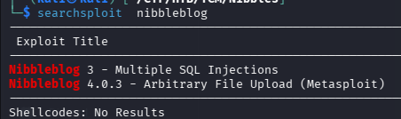

---

# Enumerating the Admin Panel

The administrative interface was located at:

```
http://10.129.166.240/nibbleblog/admin/
```

Directory indexing was enabled, exposing the structure of the administration panel.

> 📷 **Screenshot**

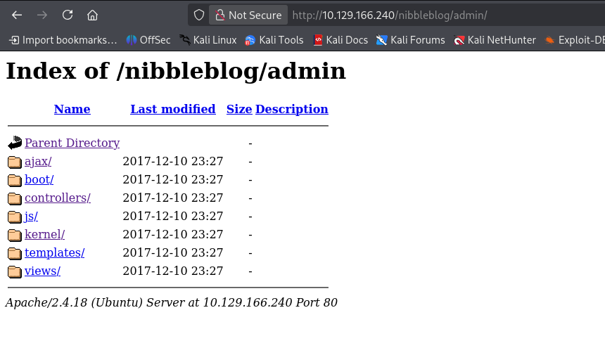

After authenticating with valid credentials, access to the administrator dashboard was obtained.

> 📷 **Screenshot**

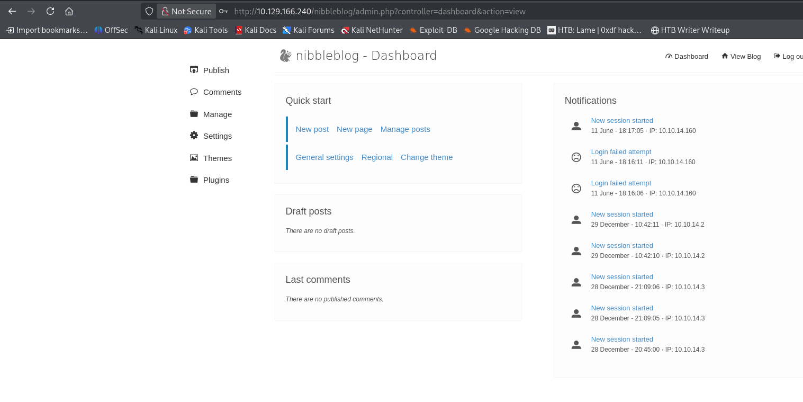

---

# Exploiting the Plugin Upload Feature

Nibbleblog allows administrators to install plugins through the web interface.

A PHP reverse shell was generated using **revshells.com**.

> 📷 **Screenshot**

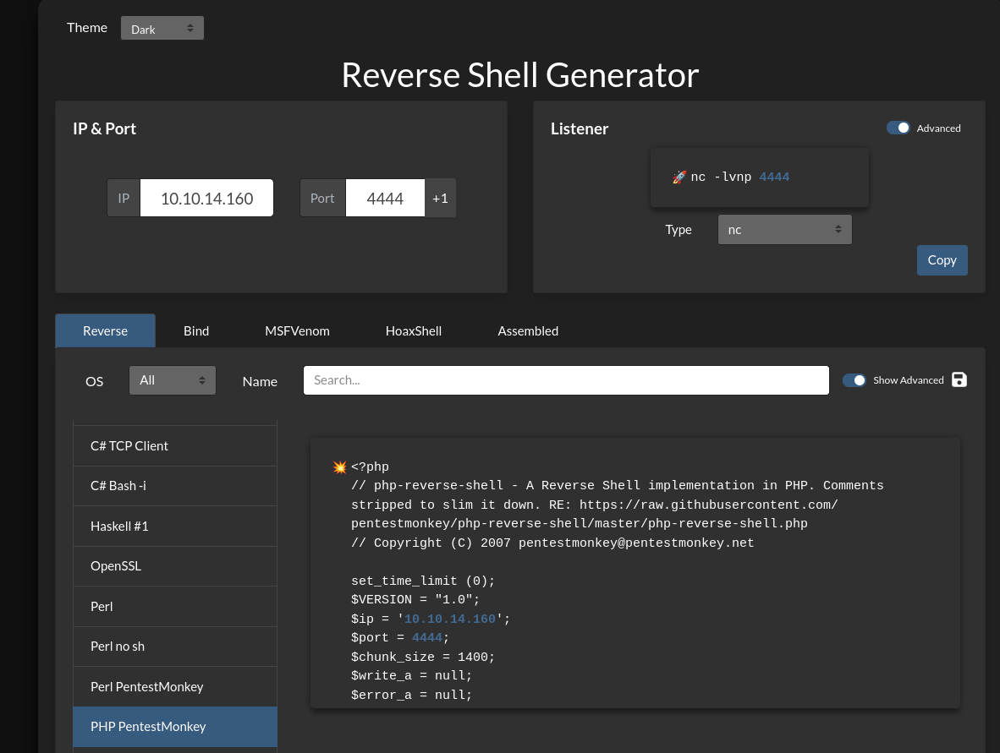

The generated payload was saved as:

```
revshell.php
```

It was then uploaded through the vulnerable plugin upload functionality.

> 📷 **Screenshot**

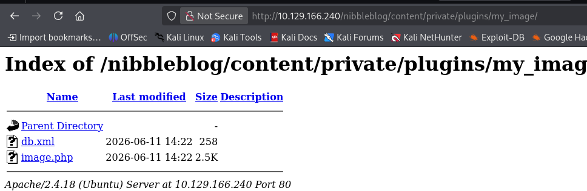

After the upload completed successfully, the payload became accessible on the server.

---

# Triggering the Reverse Shell

A Netcat listener was started on the attack machine.

```bash
nc -lvnp 4444
```

The uploaded PHP payload was then executed from the browser.

Once accessed, the target initiated a reverse connection back to the attacker.

> 📷 **Screenshot**

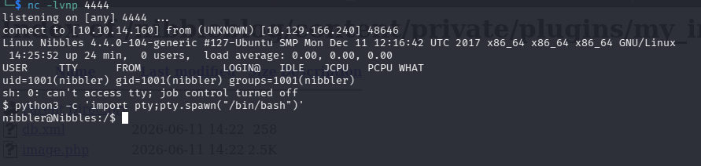

An initial shell was successfully established as the **nibbler** user.

---

# Stabilizing the Shell

To obtain a fully interactive terminal, the shell was upgraded using Python.

```bash
python3 -c 'import pty; pty.spawn("/bin/bash")'
```

With an interactive shell available, post-exploitation and privilege escalation enumeration could begin.

# User Enumeration

After obtaining an interactive shell, the user's home directory was inspected.

```bash
cd /home/nibbler

ls
```

The directory contained:

- `user.txt`
- `personal.zip`

> 📷 **Screenshot**

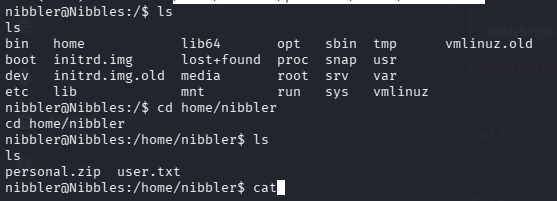

The **user flag** was captured before continuing with privilege escalation.

---

# Privilege Escalation Enumeration

The archive **personal.zip** appeared interesting and was extracted.

```bash
unzip personal.zip
```

After extraction, a directory named **personal** was created.

```bash
ls -la personal
```

Inside it was another directory named **stuff** containing a shell script.

```bash
ls -la personal/stuff/monitor.sh
```

The script was writable by the current user.

> 📷 **Screenshot**

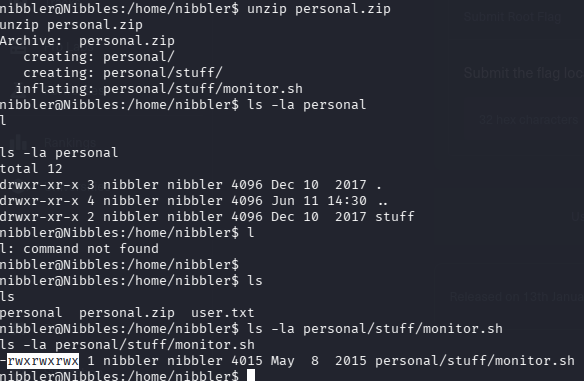

---

# Abusing the Writable Script

Since `monitor.sh` was writable, its contents were replaced with a command that would execute a Bash shell.

```bash
echo "exec /bin/bash --login" > monitor.sh
```

The modified script was then executed with sudo.

```bash
sudo ./monitor.sh
```

Because the script was allowed to run as root without requiring a password, execution immediately spawned a privileged shell.

> 📷 **Screenshot**

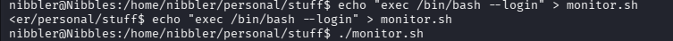

Privilege verification confirmed full administrative access.

```bash
whoami
```

Output:

```text
root
```

---

# Capturing the Root Flag

With root privileges obtained, the root flag was collected successfully, completing the machine.

> 📷 **Screenshot**

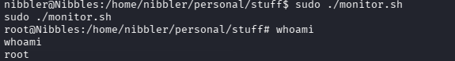

---

# Findings

| Finding | Severity |
|----------|----------|
| Exposed Nibbleblog Installation | Medium |
| Authenticated Plugin File Upload | Critical |
| Arbitrary PHP Code Execution | Critical |
| Writable Script Executed via sudo | Critical |
| Root Privilege Escalation | Critical |

---

# Skills Practiced

- Network Enumeration
- Web Enumeration
- Source Code Analysis
- CMS Fingerprinting
- Searchsploit Usage
- Authenticated File Upload Exploitation
- PHP Reverse Shell Deployment
- Linux Shell Stabilization
- Linux Enumeration
- Archive Analysis
- Sudo Privilege Escalation
- Linux Post-Exploitation

---

# Tools Used

- Nmap
- Firefox
- Searchsploit
- revshells.com
- Netcat
- Python
- unzip
- sudo

---

# Key Takeaways

- Hidden directories are frequently exposed through HTML comments.
- CMS fingerprinting can quickly identify known attack vectors.
- Authenticated file upload vulnerabilities often lead directly to remote code execution.
- Writable files executed through sudo are a common Linux privilege escalation vector.
- Thorough local enumeration is essential after gaining an initial foothold.

---

# Disclaimer

This walkthrough is intended for educational purposes only. All testing was performed in an authorized Hack The Box laboratory environment.

